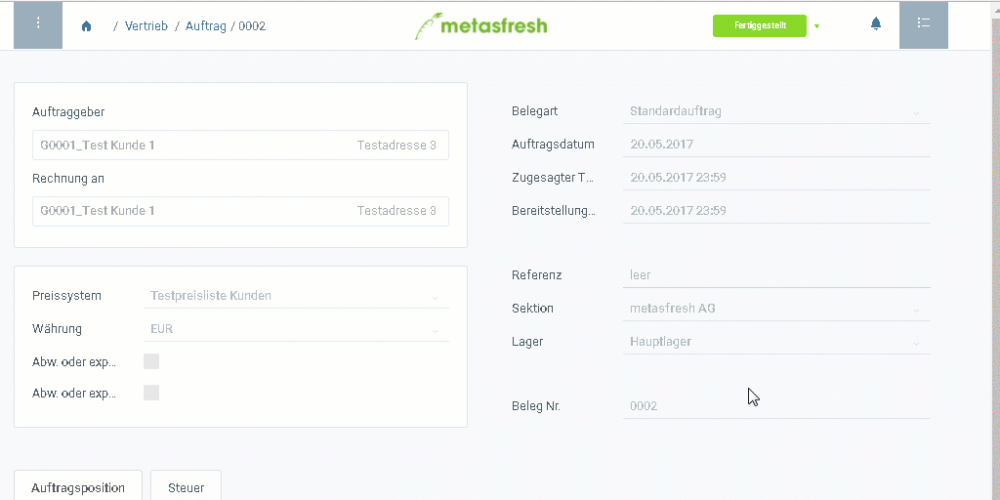

## Schritte
1. Öffne einen [gelieferten Auftrag](Zu_Auftrag_Lieferschein_erstellen).
1. [Springe zur](SpringezuBelegen) "Rechnungsdisposition".
1. [Selektiere die Auftragszeilen](AuswahlBelege), die Du abrechnen möchtest.
1. [Starte die Aktion](AktionStarten) "Auswahl fakturieren". Es öffnet sich ein Overlay-Fenster.
1. Klicke auf "Start", um zu bestätigen und das Overlay-Fenster zu schließen.
1. Du erhältst oben rechts eine Benachrichtigung , sobald die Rechnung erstellt ist.
1. Klicke auf die Benachrichtigung, um den Rechnungsbeleg zu öffnen.
1. [Öffne die PDF-Vorschau](PDFVorschau) des Belegs, um ihn auszudrucken.

## Nächste Schritte (optional)
Ist Dir bei der Rechnungserstellung ein Fehler unterlaufen oder soll sie doch an jemand anderes ausgestellt werden? Kein Problem!
- [Storniere die Rechnung einfach](Rechnung_stornieren) und korrigiere sie und/oder
- [ändere bei Bedarf die Rechnungsempfängerdaten nachträglich](Rechnungsadresse_nachtraeglich_aendern).

## Beispiel

