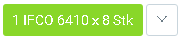
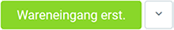

## Schritte
1. Öffne eine [fertige Bestellung](Bestellung_erfassen).
1. [Springe zur](SpringezuBelegen) Wareneingangsdisposition.
1. [Selektiere die Zeilen](AuswahlBelege), die Du als Wareneingang buchen möchtest.
1. Klicke auf den voreingestellten [Quick-Actions](AktionStarten)-Button, z.B. . Es öffnet sich das "HU Editor"-Fenster.
1. Bestätige den Wareneingang mit dem Button .
1. Klicke auf "Bestätigen", um das Fenster zu schließen.
1. Du erhältst oben rechts eine Benachrichtigung  über die erfolgreiche Erstellung desWareneingangs.

## Beispiel

