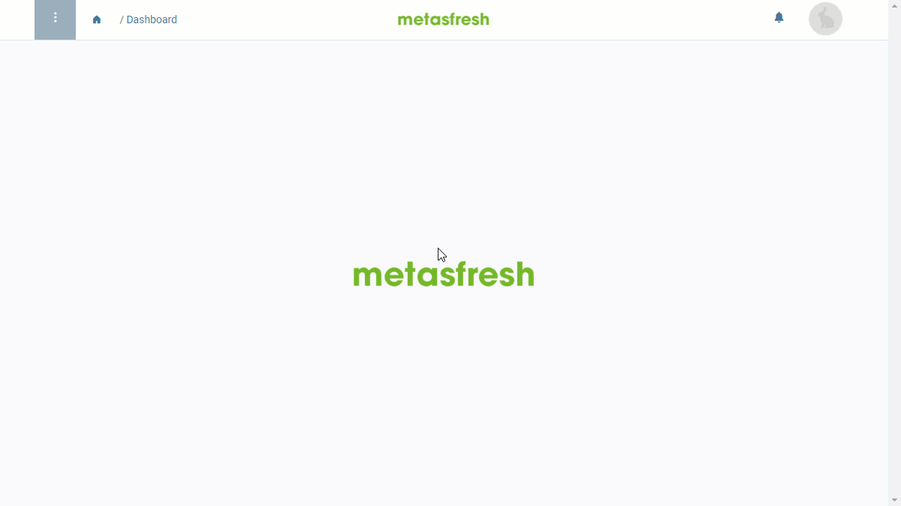

## Überblick
In metasfresh kann man mittels [Benutzerrollen](NeueBenutzerrolle) konfigurieren, auf welche Fenster und Funktionen einzelne [Nutzer](Nutzer_anlegen) zugreifen dürfen. Darüber hinaus lässt sich der Nutzerzugriff aber auch innerhalb der freigegebenen Fenster für bestimmte Dateneinträge einschränken oder erweitern. Das bedeutet also, dass ein Nutzer, obwohl er auf ein Fenster zugreifen darf, gegebenenfalls einzelne oder alle Einträge z.B. nur lesen, aber nicht bearbeiten kann. Der Zugriff auf diese Verwaltungsfunktionen für Datensatzberechtigungen ("Zugriff gewähren" und "Zugriff entziehen") kann ebenfalls flexibel und individuell konfiguriert werden.

## Voraussetzungen
- [Richte den Zugriff auf die Verwaltungsfunktionen für Datensatzberechtigungen ein](Datensatzberechtigungen_einrichten). (Systemadministrator)

## Schritte
1. [Gehe ins Menü](Menu) und öffne ein beliebiges Fenster, in dem Du den Nutzerzugriff verwalten möchtest, z.B. "Geschäftspartner".
    >**Hinweis:** Um den Datenzugriff in einem Fenster verwalten zu können, muss die zugrunde liegende Datenbanktabelle als [Berechtigungseintrag](Datensatzberechtigungen_einrichten) in dem Rolleneintrag des aktuell angemeldeten Benutzers vorhanden sein.

1. Öffne einen bestehenden Eintrag oder [lege einen neuen an](Neuer_Datensatz_Fenster_Webui).
1. [Starte die Aktion](AktionStarten#aktionsmenue) "Zugriff gewähren" oder "Zugriff entziehen", je nach Absicht. Es öffnet sich ein Overlay-Fenster.
1. Wähle im Feld **Access** die Art des Zugriffs aus, z.B. *Read*, *Write*, *Export* oder *Report*.
1. Wähle im Feld **Typ** die Art des Nutzers aus, z.B. einen einzelnen *[Nutzer](Nutzer_anlegen)* oder eine *[Nutzergruppe](Nutzergruppe_erstellen)*.
1. Gib in das Feld **Ansprechpartner** (bzw. **Nutzergruppe**) einen Teil des Namens des Nutzers bzw. der Nutzergruppe ein, dessen/deren Zugriffsberechtigung angepasst werden soll, und klicke auf den passenden Treffer in der <a href="Keyboard_Shortcuts_Liste#dropdown" title="Dynamisches Suchfeld (Autocomplete)">Dropdown-Liste</a>.
1. Klicke auf "Start", um die Änderungen zu übernehmen und das Overlay-Fenster zu schließen.
1. [metasfresh speichert automatisch](Speicheranzeige).

## Beispiel
<kbd></kbd>
