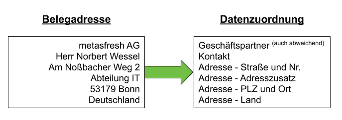
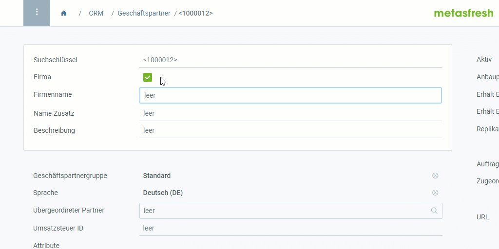
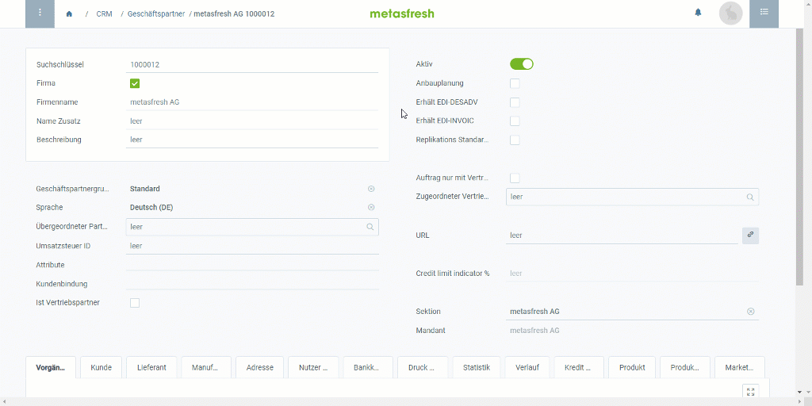
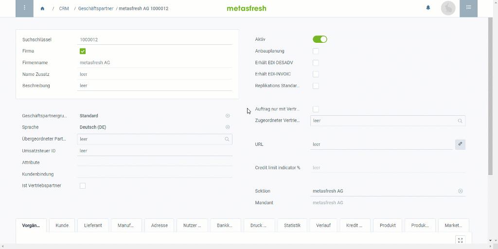

## Überblick
Die Adresse auf Belegen wie [Auftragsbestätigung](Auftrag_erfassen), [Lieferschein](Zu_Auftrag_Lieferschein_erstellen), [Rechnung](Zu_Auftrag_Rechnung_erstellen) usw. setzt sich in metasfresh aus verschiedenen Daten zusammen.

Hier siehst Du an einem Beispiel, woraus sich eine Belegadresse zusammensetzt:

  

| Belegadresse | Quelle | Wo zu finden? | Video |
| :--- | :--- | :--- | :---: |
| metasfresh AG | Geschäftspartner | Fenster **Geschäftspartner** &#8658; Feld **Firmenname** / **Name** | <kbd></kbd> |
| metasfresh AG | Abw. Firmenname | Fenster **Geschäftspartner** &#8658; Register **Adresse** &#8658; Feld **Abw. Firmenname** | <kbd></kbd> |
| Herr Norbert Wessel | Kontakt | Fenster **Geschäftspartner** &#8658; Register **Nutzer/Kontakt** &#8658; Felder **Anrede**, **Vorname** und **Nachname** | <kbd></kbd> |
| Am Noßbacher Weg 2 | Straße und Nr. | Fenster **Geschäftspartner** &#8658; Register **Adresse** &#8658;  (Feld **Anschrift**) &#8658; Feld **Straße und Nummer** | <kbd></kbd> |
| Abteilung IT | Adresszusatz | Fenster **Geschäftspartner** &#8658; Register **Adresse** &#8658;  (Feld **Anschrift**) &#8658; Feld **Adresszusatz** | <kbd></kbd> |
| 53179 | PLZ | Fenster **Geschäftspartner** &#8658; Register **Adresse** &#8658;  (Feld **Anschrift**) &#8658; Feld **PLZ** | <kbd></kbd> |
| Bonn | Ort | Fenster **Geschäftspartner** &#8658; Register **Adresse** &#8658;  (Feld **Anschrift**) &#8658; Feld **Ort** | <kbd></kbd> |
| Deutschland | Land | Fenster **Geschäftspartner** &#8658; Register **Adresse** &#8658;  (Feld **Anschrift**) &#8658; Feld **Land** | <kbd></kbd> |

# Nächste Schritte
1. [Erfasse einen neuen Geschäftspartner](Neuer_Geschaeftspartner).
1. [Erfasse eine Adresse für einen Geschäftspartner](Adresse_erfassen_Tab).
