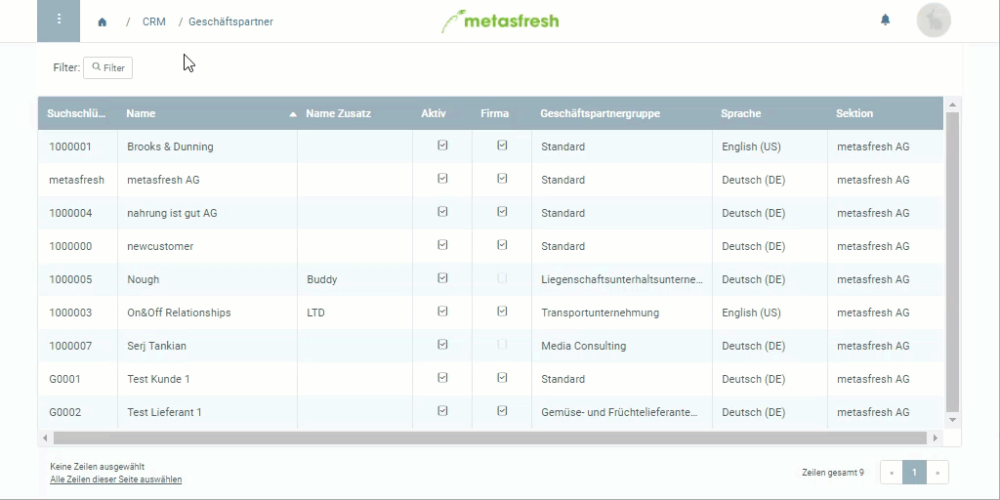

## Überblick

In metasfresh gibt es *Verkaufspreislisten* und *Einkaufspreislisten*. Die Verkaufspreislisten können den [Kunden](Neuer_Geschaeftspartner_Kunde) zugewiesen werden und die Einkaufspreislisten den [Lieferanten](Neuer_Geschaeftspartner_Lieferant). Diese beiden Preislistenarten können ebenfalls [Partnergruppen](Zuweisung_Preise_Partnergruppe) zugewiesen werden.

## Schritte

### Verkaufspreisliste einem Kunden zuweisen
Um eine *Verkaufspreisliste* zu erhalten, musst Du in dem entsprechenden Preislisteneintrag das Häkchen bei **Verkaufspreisliste** setzen (siehe **Schritt 8** von "[Wie lege ich eine Preisliste an?](Preisliste_anlegen)"). Hast Du dies getan, kannst Du wie folgt fortfahren:

1. Öffne den Eintrag eines bestehenden Kunden aus Deinen [Geschäftspartnern](Menu) bzw. [lege einen neuen an](Neuer_Geschaeftspartner_Kunde).
1. Gehe zur Registerkarte "Kunde" unten auf der Seite.
1. Klicke doppelt auf das Feld **Preissystem** der Kundenzeile und wähle aus der Dropdown-Liste das gewünschte [Preissystem](Preissystem_anlegen) aus.
1. [metasfresh speichert automatisch](Speicheranzeige).

---

### Einkaufspreisliste einem Lieferanten zuweisen
Um eine *Einkaufspreisliste* zu erhalten, musst Du in dem entsprechenden Preislisteneintrag das Häkchen bei **Verkaufspreisliste** entfernen (siehe **Schritt 8** von "[Wie lege ich eine Preisliste an?](Preisliste_anlegen)"). Hast Du dies getan, kannst Du wie folgt fortfahren:

1. Öffne den Eintrag eines bestehenden Lieferanten aus Deinen [Geschäftspartnern](Menu) bzw. [lege einen neuen an](Neuer_Geschaeftspartner_Lieferant).
1. Gehe zur Registerkarte "Lieferant" unten auf der Seite.
1. Klicke doppelt auf das Feld **Einkaufspreissystem** der Lieferantenzeile und wähle aus der Dropdown-Liste das gewünschte Preissystem aus.
1. [metasfresh speichert automatisch](Speicheranzeige).

## Nächste Schritte (alternativ)
- [Weise Preislisten einer ganzen Geschäftspartnergruppe zu](Zuweisung_Preise_Partnergruppe).

## Beispiel

