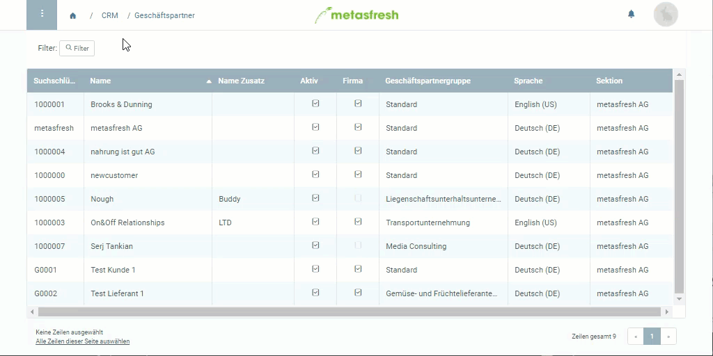

## Überblick
<kbd></kbd>

In metasfresh gibt es *Verkaufspreislisten* und *Einkaufspreislisten*. Verkaufspreislisten werden [Kunden zugewiesen](Zuweisung_Preise_Partner#verkaufspreisliste) und enthalten Verkaufsprodukte, während Einkaufspreislisten für [Lieferanten](Zuweisung_Preise_Partner#einkaufspreisliste) verwendet werden und Produkte für den Einkauf enthalten. Diese beiden Preislistenarten können ebenfalls [Partnergruppen](Neue_Geschaeftspartnergruppe) zugewiesen werden.

## Schritte

### Preisliste einer Partnergruppe zuweisen
1. Öffne den Eintrag einer bestehenden [Geschäftspartnergruppe](Menu) bzw. [lege eine neue an](Neue_Geschaeftspartnergruppe).
 >**Hinweis:** Springe alternativ über einen [Geschäftspartnereintrag](Neuer_Geschaeftspartner) [zum Inhalt des Feldes](Springezu) **Geschäftspartnergruppe**.

1. Wähle das gewünschte **Preissystem** aus.
1. [metasfresh speichert automatisch](Speicheranzeige).

## Nächste Schritte (alternativ)
- [Weise Preislisten einzelnen Geschäftspartnern zu](Zuweisung_Preise_Partner).

## Beispiel
<kbd></kbd>
