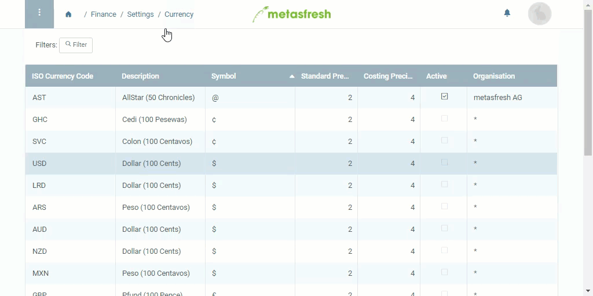

## Steps
1. Open "Currency" from the [menu](Menu).
1. From the [list view](ViewModes#list-view), open the entry of the currency you want to activate.
1. [Activate](Activate_record) the currency.

## Example
<kbd></kbd>
