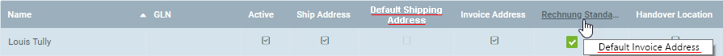
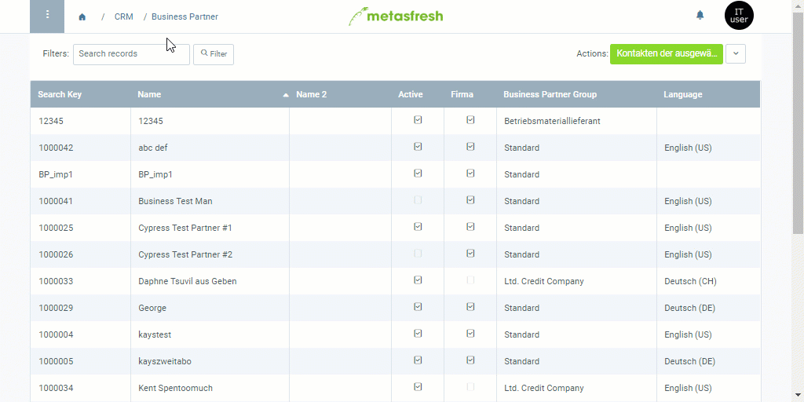

## Overview
Any contacts you want to add to a mailing list of a [marketing campaign](Create_MKTG_campaign) must be registered as [users](Add_user) in your system. 
If you want to add [business partners](New_Business_Partner) to the mailing list of a marketing campaign, you first have to [add a user](Add_user_to_BPartner) to their entry.

### Requirements for Email Campaigns
For contacts (users or business partners) to be added to the mailing list of an *email campaign*, an [email address must be indicated in the user entry](Add_user).

### Requirements for Serial Letter Campaigns
For contacts (users or business partners) to be added to the mailing list of a *serial letter campaign*, a [default address must be indicated in the business partner entry](Add_address_tab), e.g., *Default Shipping Address* or *Default Invoice Address*. This might require the user to be [linked to a business partner](Assign_BPartner_to_user) first.  

## Steps

### Add Contacts from Business Partners

#### a) to an Email Campaign
1. Open "Business Partner" from the [menu](Menu).
1. From the [list view](ViewModes), [select](RecordSelection) the [business partners](New_Business_Partner) you want to add as contacts to your email campaign.
1. [Start the quick action](StartAction) "Export in E-Mail Campaign". An overlay window opens up.
 >**Note:** You will also find this action in the actions menu in both the list view and the detailed view of an entry.

1. In the field **MKTG_Campaign**, enter a part of the email campaign and click on one of the results.
 >**Note 1:** Hit `SPACE` to see all available [marketing campaigns](Create_MKTG_campaign).  
 >**Note 2:** Select one of the shown options with the mouse or .

1. Click "Start" to close the overlay window and add the contacts to the email campaign.

#### b) to a Serial Letter Campaign
1. Open "Business Partner" from the [menu](Menu).
1. From the [list view](ViewModes), [select](RecordSelection) the [business partners](New_Business_Partner) you want to add as contacts to your serial letter campaign.
1. [Start the action](StartAction) "Export in Serial Letter Campaign". An overlay window opens up.
 >**Note:** You will also find this action in the actions menu in the detailed view of an entry.

1. In the field **MKTG_Campaign**, enter a part of the serial letter campaign and click on one of the results.
 >**Note 1:** Hit `SPACE` to see all available [marketing campaigns](Create_MKTG_campaign).  
 >**Note 2:** Select one of the shown options with the mouse or .

1. In the field **DefaultAddressType**, select the type of default address where the serial letters shall later be sent to, e.g., *BillToDefault* or *ShipToDefault*.
 >**Note:** Make sure the corresponding fields in the corresponding line under the record tab "Location" of the respective business partner entry are activated.

1. Click "Start" to close the overlay window and add the contacts to the serial letter campaign.

---

### Add Contacts from Users

| **Special Note:** |
| :- |
| For users, you cannot choose separately between the actions *Export in E-Mail* or *Serial Letter Campaign* separately. Whether you require an email address or a default address therefore depends on the type of marketing campaign, or rather the [marketing platform](Create_MKTG_platform) configurations.  For an *email campaign*, an **email address** must be indicated in the user entry! In this case, the user does not have to be linked to a business partner.  In a *serial letter campaign*, however, the user does have to be [linked to a business partner](Assign_BPartner_to_user) who, in turn, must possess a **default invoice address**! |

1. Open "User" from the [menu](Menu).
1. From the [list view](ViewModes), [select](RecordSelection) the [users](Add_user) you want to add as contacts to your marketing campaign.
1. [Start the quick action](StartAction) "Kontaktperson aus Nutzer" (*Add contact from user*). An overlay window opens up.
 >**Note:** You will also find this action in the actions menu in both the list view and the detailed view of an entry.

1. In the field **MKTG_Campaign**, enter a part of the marketing campaign and click on one of the results.
 >**Note 1:** Hit `SPACE` to see all available [marketing campaigns](Create_MKTG_campaign).  
 >**Note 2:** Select one of the shown options with the mouse or .

1. Click "Start" to close the overlay window and add the contacts to the marketing campaign.
  

| **General Note:** |
| :- |
| You will find the added contacts under the record tab "Kontaktperson" (*Contact*) at the bottom of the page of the respective marketing campaign's entry under "[Marketing Campaign](Menu)" in the menu. |

## Example

