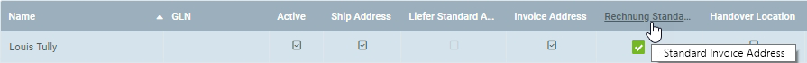

## Overview
Any contacts you want to add to a mailing list of a [marketing campaign](Create_MKTG_campaign) must be registered as [users](Add_user) in your system and [linked to a business partner](Assign_BPartner_to_user).

If you want to add [business partners](New_Business_Partner) to the mailing list of a marketing campaign, you first have to [add a user](Add_user_to_BPartner) to their entry.

| **General Note:** |
| :- |
| For contacts (users or business partners) to be added to the mailing list of the marketing campaign, an [address in the business partner entry](Add_address_tab) must be set as **Standard Invoice Address**.   |

## Steps

### Add Contacts

#### a) Contacts from Business Partners
1. Open "Business Partner" from the [menu](Menu).
1. From the [list view](ViewModes), [select](RecordSelection) the [business partners](New_Business_Partner) you want to add as contacts to your marketing campaign.
1. [Start the quick action](StartAction) "Export in E-Mail Campaign". An overlay window opens up.
 >**Note:** You will also find this action in the actions menu in both the list view and the detailed view of an entry.

#### b) Contacts from Users
1. Open "User" from the [menu](Menu).
1. From the [list view](ViewModes), [select](RecordSelection) the [users](Add_user) you want to add as contacts to your marketing campaign.
1. [Start the quick action](StartAction) "Kontaktperson aus Nutzer" (*Add contact from user*). An overlay window opens up.
 >**Note:** You will also find this action in the actions menu in both the list view and the detailed view of an entry.

### Select a Marketing Campaign
1. In the field **MKTG_Campaign** enter a part of the marketing campaign and click on one of the results.
 >**Note 1:** Hit `SPACE` to see all available [marketing campaigns](Create_MKTG_campaign).  
 >**Note 2:** Select one of the shown options with the mouse or .

1. Click "Start" to close the overlay window and add the contacts to the marketing campaign.
 

| **Note:** |
| :- |
| You will find the contacts in the record tab "Kontaktperson" (*Contact*) at the bottom of the page of the respective marketing campaign's entry under "[Marketing Campaign](Menu)" in the menu. |

## Example

