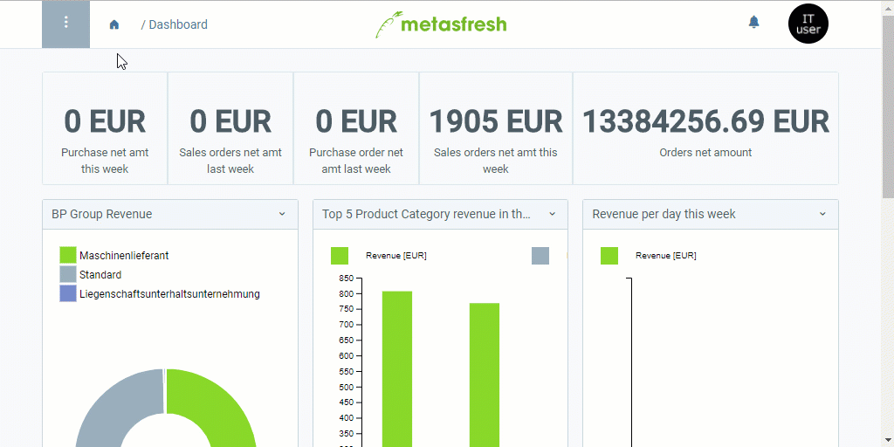

## Overview
By means of the credit limit types, it is possible to name and organize the credit limits you set for your business partners, and thereby indicate what the limits are meant for, or who or which division has placed them.

For instance, you are using a credit limit type called "Insurance" in order to indicate that this limit was placed for insurance reasons. The manager wants to increase the limit amount, however, and so they choose the limit type "Management" to set a new credit limit.   Regarding this, metasfresh decides depending on the start date of the credit limit, whether or not it takes effect. This may also provide a way to override expired limits with new ones.

Furthermore, with the credit limit type it is possible to configure that the credit limit is approved automatically, meaning no authorized user's approval is required.

## Steps
1. Open "Credit Limit Type" from the [menu](Menu).
1. [Add a new credit limit type](New_Record_Window).
1. Give the credit limit type a **Name**.
1. Determine a **Sequence** in which the credit limit type is to be listed in the drop-down list when [setting the credit limit](Set_credit_limit).
1. ***Optional:*** Check the box **Auto Approval** if you want the credit limit to be approved without confirmation of an authorized user.
 >**Note:** In this case, the field **Approved by** of the credit limit line remains empty after approval.

1. [metasfresh saves the progress automatically](Saveindicator).

## Example

