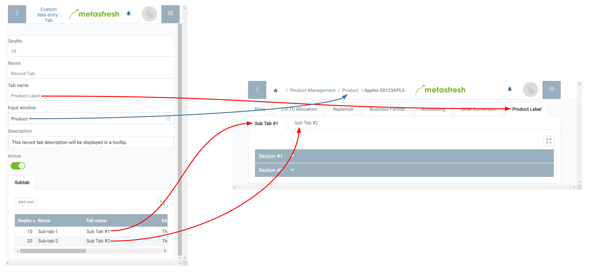

## Overview
In metasfresh you can create custom record tabs in several input windows where you can enter your own specific data. These data can be organized by subtabs, sections, lines and input fields and can also be printed in the form of [product labels or nameplates](Create_product_label).

## Steps

### Add a record tab
1. Open "Custom data entry - tab" from the [menu](Menu).
1. [Create a new entry](New_Record_Window).
1. In the field **Name**, enter a system internal record tab name.
 >**Note:** This name is for internal reference only and is not displayed as a tab name.

1. In the field **Registername** (*Tab name*), enter a tab name.
 >**Note:** This name will be displayed on the tab in the input window.

1. In the field **Eingabefenster** (*Input window*), enter a part of the name of the [window](Menu) where you want the record tab to appear and click on the matching result in the [drop-down list](Keyboard_shortcuts_reference), e.g., *Product*.
 >**Note:** In case of multiple custom record tabs for the same input window you can specify their order via the field **SeqNo**.

1. ***Optional:*** Enter a **Description** into the text box provided.
 >**Note:** This description will be shown in a tooltip.

### Add a subtab
1. Go to the record tab "Subtab" at the bottom of the page and click . An overlay window opens up.
1. In the field **Name**, enter a system internal subtab name.
 >**Note:** This name is for internal reference only and is not displayed as a subtab name.

1. In the field **Registername** (*Tab name*), enter a subtab name.
 >**Note:** This name will be displayed on the subtab in the input window.

1. ***Optional:*** Enter a **Description** into the text box provided.
 >**Note:** This description will be shown in a tooltip.

1. Click "Done" to close the overlay window and add the subtab to the list.
 >**Note 1:** Repeat steps 1 to 5 to add further subtabs.  
 >**Note 2:** In case of multiple subtabs for the same custom record tab you can specify their order via the field **SeqNo**.

 

| **Important note:** |
| :--- |
| The custom record tab will only be displayed in the respective input window if it contains sections and fields. |

## Next Steps
- [Add sections to the subtabs](Add_section_to_sub_tab).

## Example

