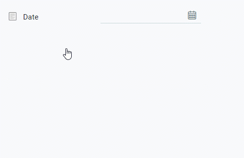
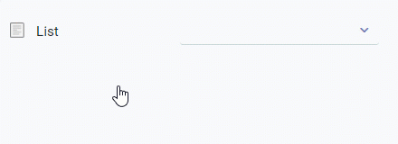
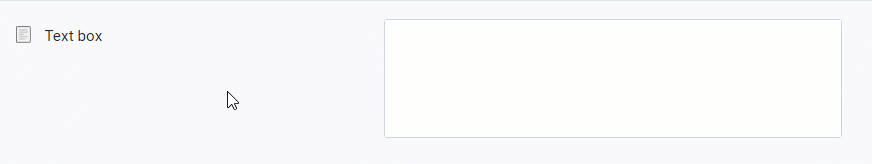
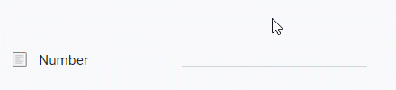
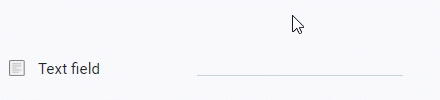
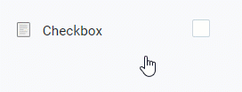

## Requirements
- [Add sections with section lines to a subtab](Add_section_to_sub_tab).

## Steps

### Add field
1. Open "Custom data entry - field" from the [menu](Menu).
1. [Create a new entry](New_Record_Window).
1. Give the field a **Name**.
 >**Note:** The field name will be displayed in the appropriate place in the section line.

1. In the field **Line**, enter part of the (system internal) name of the [section](Add_section_to_sub_tab) containing the line where you want the field to appear and click on the matching result in the <a href="Keyboard_shortcuts_reference#dropdown" title="Dynamic Search Box (Autocompletion)">drop-down list</a>.
 >**Note 1:** The line sequence number is found at the end of the result.  
 >**Note 2:** In case of multiple fields for the same section line you can specify their order via the field **SeqNo**.

1. Pick a **Datentyp** (*Data type*), e.g., *Date*, *List*, *Long text*, *Number*, *Text* or *Yes-No*.
 >**Note:** When choosing the data type *List* you also have to add list items that can be suggested and selected in the list later on (see below).

1. ***Optional:*** Enter a **Description** into the text box provided.
 >**Note:** This description will be shown in a tooltip.

1. ***Optional:*** Tick the checkbox **Pflichtangabe** (*Mandatory*) if you want the field to be mandatory.
1. Clear the checkbox **Available in API** if you do not want this field to be available to external applications via metasfresh API.
1. Pick a **Data protection category**, e.g., *Not personal*, *Personal* or *Sensitive personal*.

### Add list items (data type: *List*)
1. Go to the record tab "Entry field value" at the bottom of the page and click . An overlay window opens up.
1. Give the list item a **Name**.
1. ***Optional:*** Enter a **Description** into the text box provided.
 >**Note:** This description will be shown in a tooltip.

1. Click "Done" to close the overlay window and add the list item to the list.
 >**Note 1:** Repeat steps 1 to 4 to add further list items.  
 >**Note 2:** In case of multiple list items you can specify their order via the field **SeqNo**.

## Next Step (optional)
- [Create a custom product label](Create_product_label).

## Overview of the fields

| Data Type | Example |
| :--- | :---: |
| *Date* |  |
| *List* |  |
| *Long text* |  |
| *Number* |  |
| *Text* |  |
| *Yes-No* |  |
