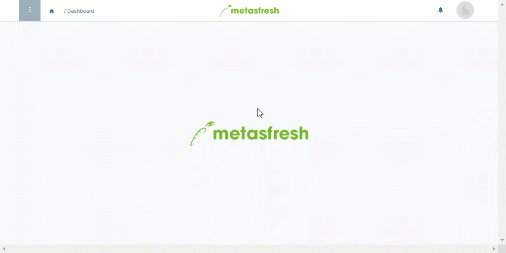

## Overview
A grouping product is a technical auxiliary product used in [sales orders](SalesOrder_recording) and [quotations](Create_SalesQuotation) to combine multiple order lines into compensation groups for further joint processing.

During [group discounting](Order_line_group_discount), for instance, it is applied in the form of a [*discount product*](Create_manual_compensation_groups) to combine the selected order lines into a group and then apply joint discounts or surcharges.

When [creating bills of materials from a quotation](Create_BOM_upon_SO_generation), the grouping product helps to identify manufacturing parts as quotation groups so that they can then be combined to give a new sales product with a bill of materials through [manual compensation grouping](Create_manual_compensation_groups).

A grouping product is basically added like any other normal [product](NewProduct) too, taking into account the following application-specific configuration:

## Steps
1. Open "Product" from the [menu](Menu).
1. [Add a new product](New_Record_Window).
1. Enter a meaningful **Name**, e.g., "Discount".
1. Select an appropriate [**Product Category**](NewProductCategory), e.g., *Grouping product*.
1. Uncheck the box **Stocked**.
1. [Add the product to a price list](ProductPrice).

| **Important note!** |
| :--- |
| The grouping product must ***not be stocked*** and it must be linked to the very ***same price list*** as in the sales order where it shall be used! |

### Activate grouping product for quotation grouping
1. Open the [advanced edit menu](ViewModes#adv-edit) from the [actions menu](StartAction#actions-menu).
 >**Note:** Use shortcut `Alt` + `E` / `⌥ alt` + `E`.

1. Scroll down to the checkbox **Ist Angebotsgruppe** (*Is quotation group*) and tick it.
 >**Hinweis:** This way metasfresh knows that the grouped products are a quotation group.

1. Click "Done" to apply the changes and close the advanced edit menu.
1. [metasfresh saves the progress automatically](Saveindicator).

## Next Steps (optional)
- [Add a compensation group schema including the grouping product](Create_compensation_group_schema).
- [Give a discount or surcharge on manually created compensation groups](Order_line_group_discount).
- [Give a discount or surcharge on automatically created compensation groups](Order_line_group_discount).
- [Use the grouping product to create bills of materials upon sales order generation from a quotation](Create_BOM_upon_SO_generation).

## Example

