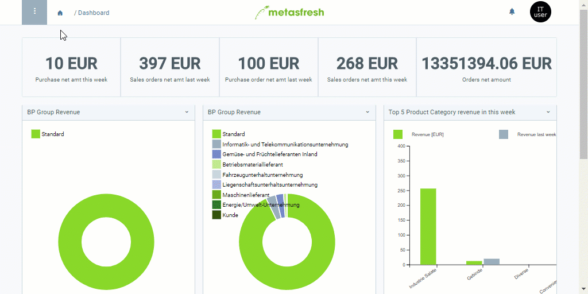

## Overview
By means of an import format, you can specify which data, or rather columns, from an import file are to be transferred, how these columns are named and delimited (separators), and into which database tables the import data are to be taken over.

Which columns you can choose from when adding an import format depends on the **DB table** that is linked to the format. As a system administrator, you can adapt, modify and extend this database table by [adding custom fields to the import format](Import_format_add_custom_fields).

The following data can be imported to metasfresh:
- [Bank statement data](Import_bank_statement_data)
- [Business partner data](Import_bpartner_data)
- [Chart of accounts data](Import_charts_of_accounts)
- [Custom data entries](Import_custom_data_entries)
- [Discount schema data](Import_discount_schema)
- [Postal data](Import_postal_data)
- [Product data](Import_product_data)
- [Replenishment data](Import_replenishment_data)
- [User data](Import_user_data)

## Steps

### Add Import Format
1. Open "Import Format" from the [menu](Menu).
1. [Add a new import format](New_Record_Window).
1. Give the import format a **Name**.
1. Select the appropriate **Table** where the data are to be imported, e.g., *Import Business Partner* for business partners, *Import Product* for products, etc. ([see overview table here](Data_import_metasfresh)).
1. Select a **Format** (separator), e.g., *Tab Separated*.
 >**Note:** In order to successfully import data, the separator in the import file must coincide with the one set in the import format (comma, semicolon, tab, etc.).

1. ***Optional:*** Tick the checkbox **IsManualImport** if you want to import the data manually. Otherwise, they will be processed automatically unless an error occurs.

### a) Add Format Fields
1. Go to the record tab "Format Field" at the bottom of the page and click . An overlay window opens up.
1. Give the format field a **Name**, e.g., "Search Key".
1. Pick a **Column** where the content of the import file is to be transferred later on, e.g., *Value_Suchschlüssel*.
1. Select a **Data Type**, e.g., *String* or *Number*, depending on the import data type.
1. Define a **Data Format**, where necessary (e.g., *dd.MM.yyyy* for the data type *Date*).
 >**Note:** You can learn more about date and time patterns <a href="https://docs.oracle.com/javase/7/docs/api/java/text/SimpleDateFormat.html" title="Date format examples | Oracle.com" target="blank">here</a>.

1. Enter a **Start No**.
 >**Note:** The **start number** determines the position where a column is expected by metasfresh in the import file during import. It has nothing to do with the order (**SeqNo**) in which the format fields were added to the import format. It is therefore not necessary that the fields are placed in a fixed and ascending order, as long as the start numbers coincide with the column positions in the import file.

1. Click "Done" to close the overlay window and add the format field to the list.
 >**Note:** Repeat steps 1 to 6 to add further format fields.

### b) Copy Format Fields
If you want to add a new import format with the same format fields as an existing format, you can very easily copy the format fields from the existing import format into the new one via the [actions menu](StartAction#actions-menu). To do so, please proceed as follows:

1. Add a new import format as described above in **steps 1 to 5**.
1. [Start the action](StartAction#actions-menu) "Copy Lines". An overlay window opens up.
1. Select the appropriate **Import Format** from which you want to copy the format fields.
 >**Note:** In order to successfully copy the format fields from an existing import format, the new format must be configured with the **_exact same_ DB table** as the existing one.

1. Click "Start" to copy the format fields and close the overlay window.

## Next Steps
- [Import bank statement data](Import_bank_statement_data).
- [Import business partner data](Import_bpartner_data).
- [Import chart of accounts](Import_charts_of_accounts).
- [Import custom data entries](Import_custom_data_entries).
- [Import discount schema data](Import_discount_schema).
- [Import postal data](Import_postal_data).
- [Import product data](Import_product_data).
- [Import replenishment data](Import_replenishment_data).
- [Import user data](Import_user_data).

## Example

