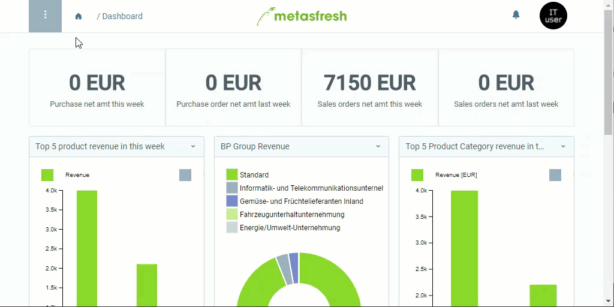

## Steps
1. Open "Calendar and Year" from the [menu](Menu).
1. [Add a new calendar](New_Record_Window).
1. Give the calendar a **Name**.
1. [metasfresh saves the progress automatically](Saveindicator).

## Next Steps
- [Add calendar periods](Add_new_calendar_periods).

## Example

