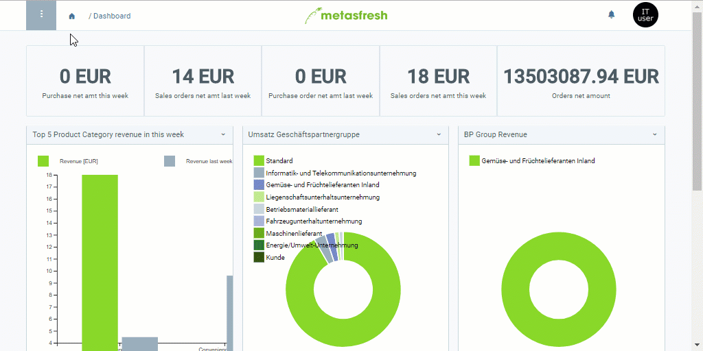

## Steps

### Create a Warehouse
1. Open "Warehouse" from the [menu](Menu).
1. [Add a new warehouse](New_Record_Window).
1. Give the warehouse a **Name**, e.g., "[Empty Container Depot](Add_empty_container_depot)".
1. In the field **Partner Location**, enter a part of the location name and click on one of the results.
 >**Note 1:** Hit `SPACE` to see all available partner locations.  
 >**Note 2:** Select one of the shown options with the mouse or .

### Add a Place of Storage
1. Go to the record tab "Locator" at the bottom of the page and click . An overlay window opens up.
1. In each of the fields **Aisle**, **Rack**, **Level** and **Tray** enter the value *0*.
1. Click "Done" to close the overlay window and add the storage place to the list.

### Warehouse Assignment
Here you can select the ***Document Base Types*** for which the warehouse shall be used, e.g., *Sales Order*, *Purchase Order*, *Material Receipt*, etc.

1. Go to the record tab "Lagerzuordnung" (*Warehouse Assignment*) at the bottom of the page and click . An overlay window opens up.
1. Select a **Document Base Type**, e.g., *Sales Order*.
1. Click "Done" to close the overlay window and add the document base type to the list.
 >**Note:** You can assign any number of document base types to a warehouse. As an example, please take a look at the warehouse entry "Main Warehouse", which is already configured appropriately.

## Example

