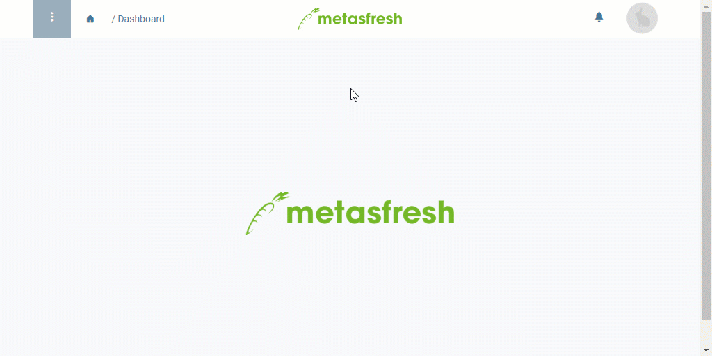

## Overview
In metasfresh, you can define different warehouse types and so organize your [warehouses](Add_new_warehouse) according to their respective properties and functions.

## Steps
1. Open "Warehouse Type" from the [menu](Menu).
1. [Add a new warehouse type](New_Record_Window).
1. Give the warehouse type a **Name**, e.g., "Distribution Center".
1. ***Optional:*** Enter a **Description** to give more information about the warehouse type.
1. [metasfresh saves the progress automatically](Saveindicator).

## Example

