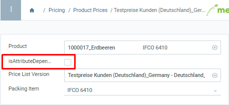
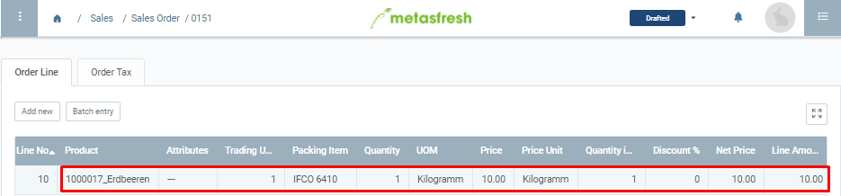
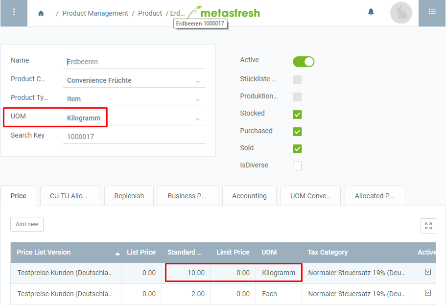
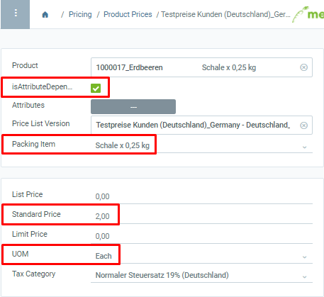
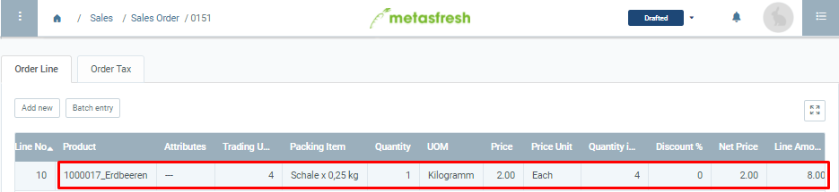
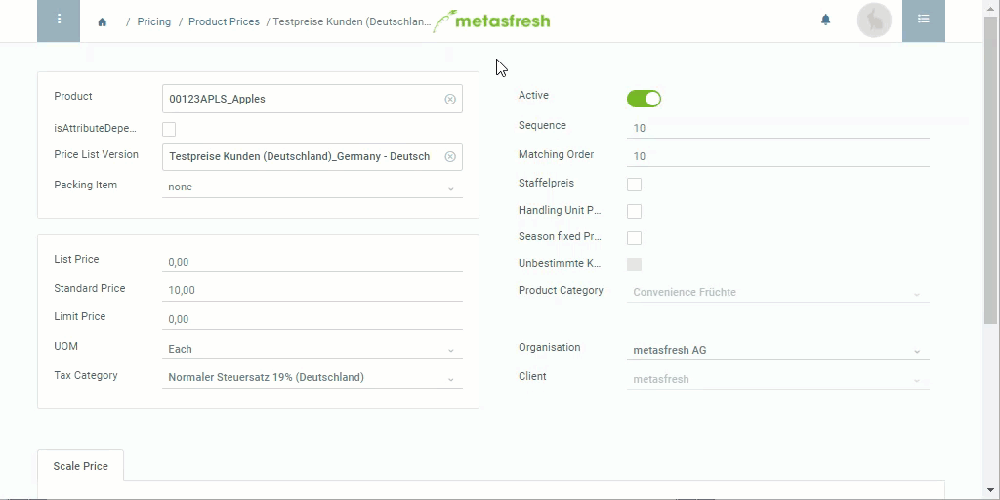

## Overview
When you sell a product you don't always sell it by the stock UOM. Instead you might determine a different sales UOM which may also be packed into a [transport unit (TU)](Handling_Unit_System).

Therefore, under "Product Prices", you can both select [packing instructions](Create_packing_instructions) as well as configure whether the price shall depend on either the stock UOM or the sales UOM.

## Steps
1. Open "Product Prices" from the [menu](Menu).
1. Open the entry of an existing price or [add a new one](Add_price).
1. Select a **Packing Item**.
 >**Note:** Packing items will only be suggested if they have been [allocated to the product](CU-TU_Allocation) beforehand.

1. If the price should be calculated based on the sales UOM defined in the price entry, check the box **isAttributeDependent**. Otherwise the product's stock UOM will be used.
 >**Note:** If sales UOM ≠ stock UOM, you have to define a [UOM conversion](Convert_UOMs).

1. [metasfresh saves the progress automatically](Saveindicator).

 
## How does the "Attribute Dependency" work?

#### Case 1: The price is *NOT* attribute dependent.
The box **isAttributeDependent** is unchecked:

| *Results:* |
| :--- |
| metasfresh calculates the order line total in the sales order based on the product's stock UOM. |

 
Sales order: 
  

Stock UOM: 

---

#### Case 2: The price *IS* attribute dependent.
The box **isAttributeDependent** is checked:

| *Results:* |
| :--- |
| metasfresh calculates the order line total in the sales order based on the product's sales UOM (see above). |

 
Sales order: 

## Example

