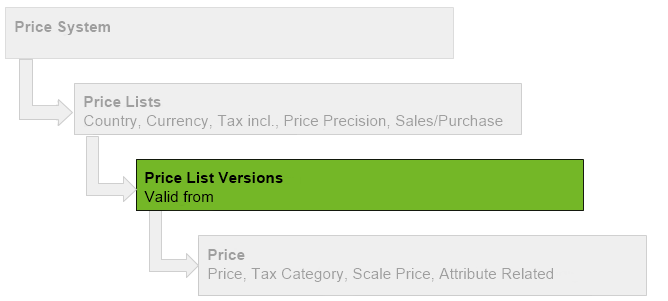

## Overview

## Steps
1. Open the entry of an existing [price list](Menu) or [create a new one](Add_price-list).
1. Go to the record tab "Price List Version" at the bottom of the page and click . A new window opens up.
1. Give the price list version a **Name** or instead use the suggested creation date.
1. Set a **Valid from** date for this version.
 >**Note:** If this date lies in the *past* the version is effective *immediately*. If it lies in the *future* the prices will only be used *from that date*. metasfresh takes the date promised of sales orders or purchase orders as reference and applies the prices according to the respective price list version valid at that time.

1. Click "Done" to close the window and add the price list version to the list.
 >**Note:** Repeat steps 2 to 5 to add further price list versions.

## Next Steps
- [Add a price](Add_price).

## Example

