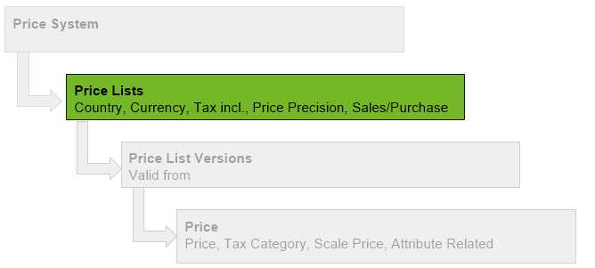

## Overview

Price lists can be country and currency-specific. Therefore they can be assigned to a particular partner (customer/vendor) or partner group.

## Steps
1. Open "Price List" from the [menu](Menu).
1. [Create a new price list](New_Record_Window).
1. Give the price list a **Name**.
1. Select the **Country** to which the price list shall apply.
 >**Note:** The country of the price list **must be identical** with the partner's country from the shipping and billing address.

1. Select a **Currency**.
1. The field **Price Precision** specifies the number of decimal places for the price calculations.
1. Select the [**Pricing System**](Add_price-system) to which the price list shall be linked.
1. The box **Sales Price List** specifies whether this price list is to be used for *Sales* and consequently becomes selectable in [sales orders](SalesOrder_recording), for instance. If you uncheck this box, it automatically becomes a ***Purchase Price List***.
1. The box **Tax incl.** specifies whether the prices are *gross* or *net* prices (i.e. including or excluding value-added tax). metasfresh calculates the prices accordingly.
1. [metasfresh saves the progress automatically](Saveindicator).

## Next Steps
- [Add a price list version](Add_price-list-version).

## Example

