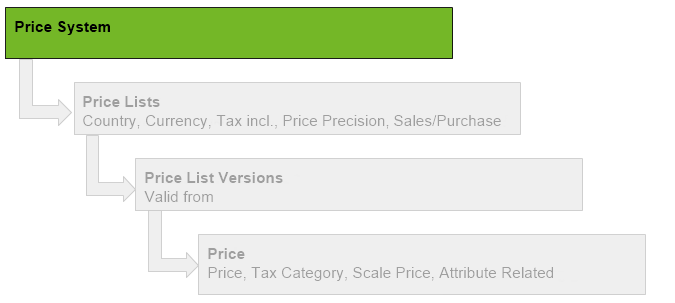

## Overview

A Price System comprises one or more country price lists that can be [assigned](Assign_prices_to_partners) to a customer/vendor or a partner group.

You can find further details on the difference between *Price System* and *Price List* [here](Price-system_versus_price_list).

## Steps
1. Open "Price System" from the [menu](Menu).
1. [Create a new Price System](New_Record_Window).
1. Give the price system a **Name**.
1. [metasfresh saves the progress automatically](Saveindicator).

## Next Steps
[Add a Price List](Add_price-list).

## Example

