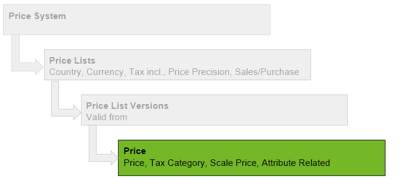

## Overview

## Steps
1. Open "Product Prices" from the [menu](Menu).
1. [Create a new price entry](New_Record_Window).
1. Enter the [**Product**](NewProduct) to which the price shall apply and select it from the results in the [drop-down list](Keyboard_shortcuts_reference).
1. In the field **Price List Version**, enter a part of the name of the designated [price list version](Add_price-list-version) and click on the matching result in the [drop-down list](Keyboard_shortcuts_reference).
1. The field **List Price** specifies the list price that will appear on the supporting documents later on.
1. The field **Standard Price** specifies the effectively valid purchase or sales price (depending on the respective price list).
1. **Limit Price**: Manual price changes made by the user, e.g., in the order line, must not fall below this amount!
1. The field **UOM** specifies the sales UOM and ***must not be confused*** with the product's stock-keeping UOM (inventory management)!
 >**Note:** If sales UOM ≠ stock-keeping UOM, you have to define a [UOM conversion](Convert_UOMs).

1. In the field **Tax Category**, you can select the respective value-added tax (VAT) category, such as *normal*, *reduced*, *tax-free*.
1. [metasfresh saves the progress automatically](Saveindicator).

## Next Steps
- [Assign the prices to a partner](Assign_prices_to_partner).

## Example

