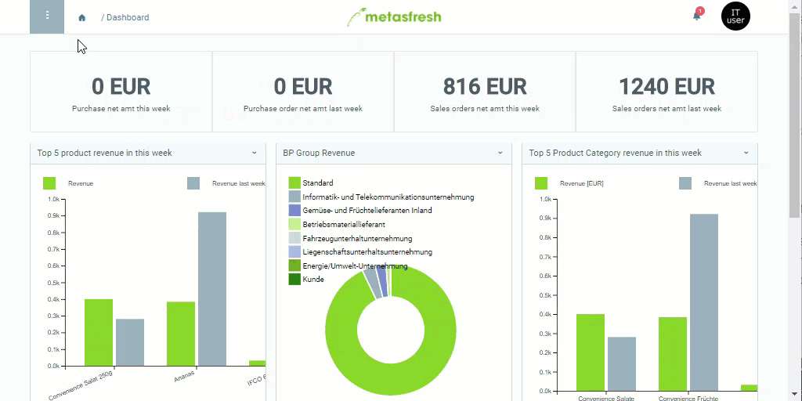

## Overview
A price list schema in metasfresh can be used to [copy existing product prices from one price list version to another](Copy_prices_from_price-list-version) or to [update various customer-specific price lists with new prices in one go](Update_derivative_PLV). In the price list schema, you can use rules to define which products are affected, for which product category and/or which business partner the schema shall apply, and whether the standard prices shall be increased by a surcharge amount.

## Steps
1. Open "Price List Schema" from the [menu](Menu).
1. [Create a new price list schema](New_Record_Window).
1. Give the price list schema a **Name**, e.g., "Copy Product Prices".
1. Set a **Valid from** date.
 >**Note:** If this date lies in the *past*, the price list schema will be effective *immediately*. If it lies in the *future*, the schema will only apply *from that date*.

1. Select the **Discount Type** *Price List*.

## Next Steps
- [Add rules (*schema lines*) to the price list schema](Price_list_schema_lines).

## Example

