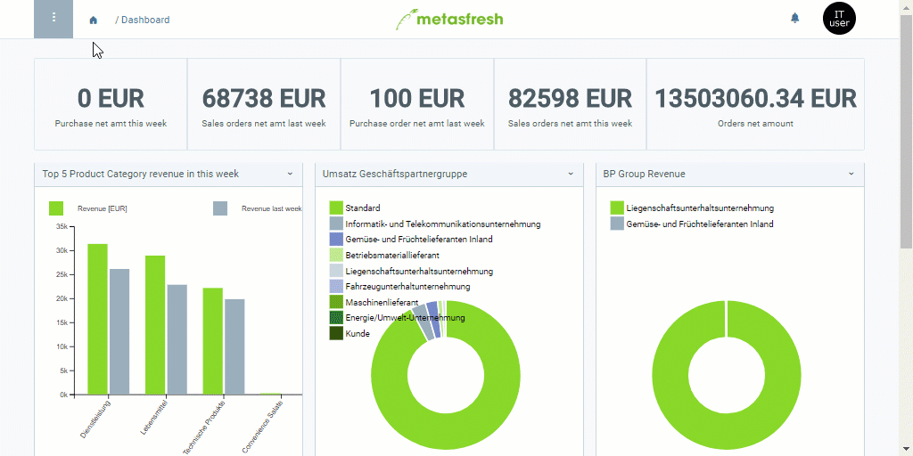

## Overview
The print format enables you, among other things, to set paper size and page layout, e.g., portrait or landscape, for the documents intended for printing.

## Steps
1. Open "Print Fromat" from the [menu](Menu).
1. [Create a new print format](New_Record_Window).
1. Give the print format a **Name**.
1. Select a **Table** to which the print format shall apply, e.g., *Letter*.
1. Pick an appropriate **Jasper Process**, e.g., *Serial Letter*.
 >**Note:** Jasper creates the layouts for the documents according to the respective settings.

1. [metasfresh saves the progress automatically](Saveindicator).
  

| **Important note:** |
| :--- |
| For the configurations to take effect on the application server, it first has to be restarted by the admin. |

## Example
<kbd></kbd>
