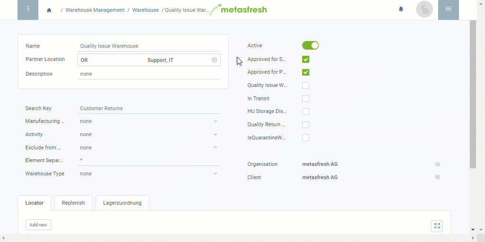

## Overview
A quality issue warehouse serves to store any returned goods, which must first be checked for integrity and completeness before they may be reintroduced into the normal distribution chain.

## Steps
1. Follow these [instructions for adding a warehouse](Add_new_warehouse) up to **step 3 of recording a place of storage**.
1. Uncheck the boxes **Approved for Sales Orders** and **Approved for Purchase Orders**.
1. Check the boxes **Quality Issue Warehouse**, **Quality Return Warehouse** and **IsQuarantineWarehouse**.
1. [metasfresh saves the progress automatically](Saveindicator).

## Example

