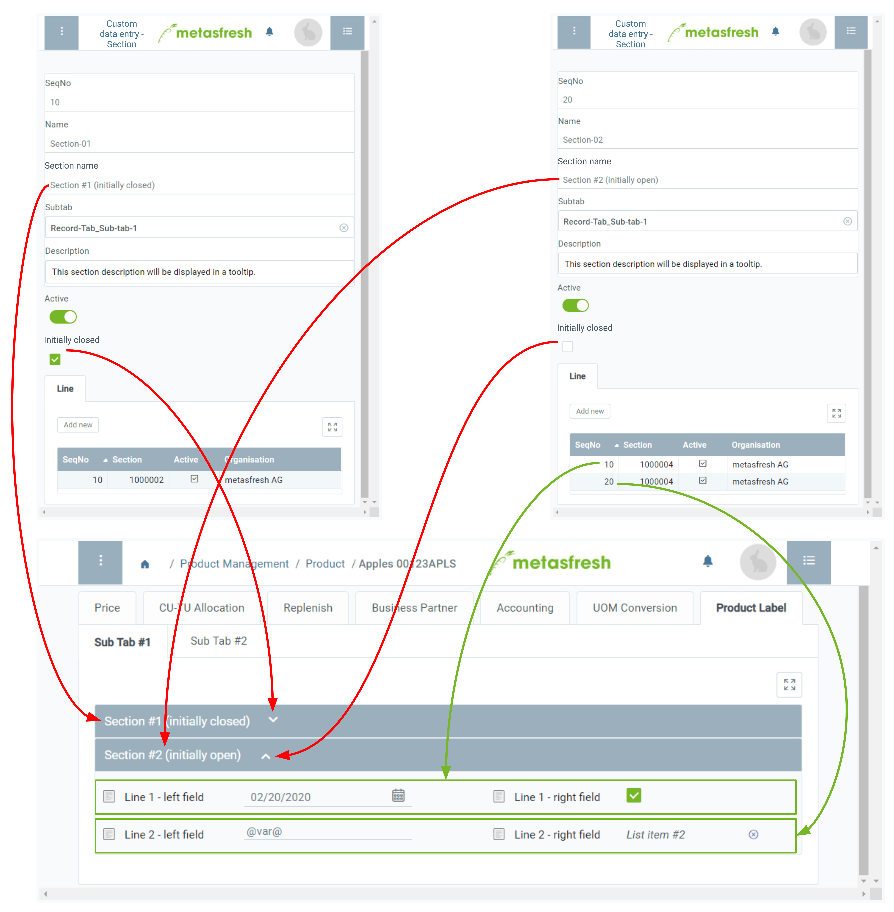

## Requirements
- [Add a custom record tab with subtabs](Add_custom_record_tab).

## Steps

### Add section
1. Open "Custom data entry - section" from the [menu](Menu).
1. [Create a new entry](New_Record_Window).
1. In the field **Name**, enter a system internal section name.
 >**Note:** This name is for internal reference only and is not displayed as a section name.

1. In the field **Sektionsname** (*Section name*), enter a section name.
 >**Note:** This name will be displayed in the appropriate place in the subtab.

1. In the field **Subtab**, enter a part of the (system internal) name of the [subtab](Add_custom_record_tab) where you want the section to appear and click on the matching result in the <a href="Keyboard_shortcuts_reference#dropdown" title="Dynamic Search Box (Autocompletion)">drop-down list</a>.
 >**Note:** In case of multiple sections for the same subtab you can specify their order via the field **SeqNo**.

1. ***Optional:*** Enter a **Description** into the text box provided.
1. ***Optional:*** Tick the checkbox **Initial geschlossen** (*Initially closed*) if you want the section to remain closed when opening the subtab.

### Add lines
1. Go to the record tab "Line" at the bottom of the page and click . An overlay window opens up.
1. Click "Done" to close the overlay window and add the line to the list.
 >**Note 1:** Repeat steps 1 to 2 to add further lines.  
 >**Note 2:** In case of multiple lines for the same section you can specify their order via the field **SeqNo**.

 

| **Important note:** |
| :--- |
| The custom record tab along with sections and lines will only be displayed in the respective input window if the section lines contain fields. |

## Next Steps
- [Add fields to the section lines](Add_fields_to_section_lines).

## Example

