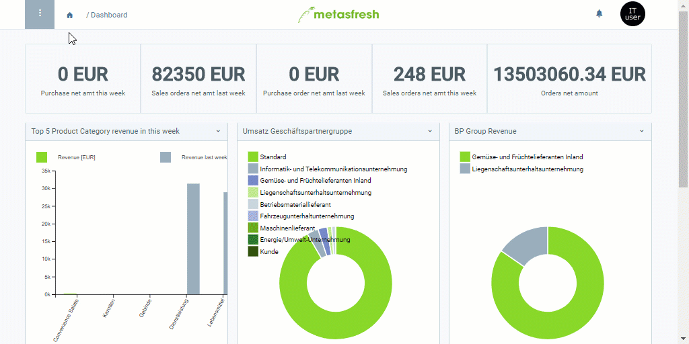

## Overview
Generally speaking, users are contacts with permission to access your system. You can register your business partners as users as well, e.g. for sending [serial letters](Create_serial_letters) to them as part of a [marketing campaign](Create_MKTG_campaign).

In order to add new users, take the following steps:

## Steps
1. [Log in to the system](Login).
1. Open "User" from the [menu](Menu).
1. [Add a new user](New_Record_Window).
1. Fill in the fields **Firstname** and **Lastname**.
1. The **Search Key** is an automatically assigned serial number. However, if required, you can also assign your own search key manually instead.

## Next Steps
- [Turn the user into a system user](New_system_user) and [assign a role to the system user](Assign_user_role) in order to grant them access to the system.
- ***Optional:*** [Assign a business partner to the user](Assign_BPartner_to_user).

## Example

