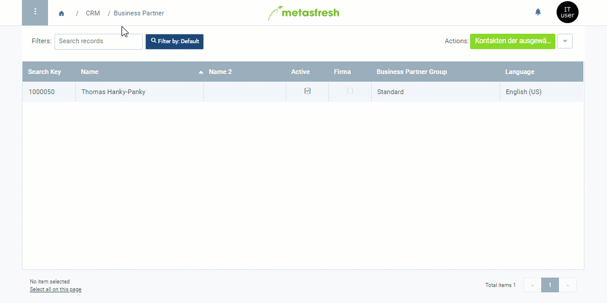

## Steps
1. Open the entry of an existing [business partner](Menu) or [add a new one](New_Business_Partner).
1. Go to the record tab "Contact" at the bottom of the page and click . A new window opens up.
1. Select a **Greeting**.
1. Fill in the fields **Firstname** and **Lastname**.
1. ***Optional:*** Fill in the fields **Email** and **Phone**.
1. Click "Done" to add the user to the list and close the window.

**Note:** You will find the newly created user entry under "[User](Menu)" in the menu.

## Example

