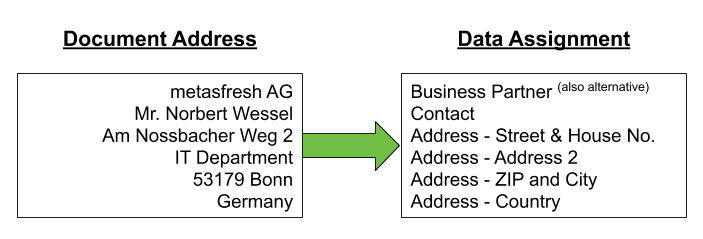
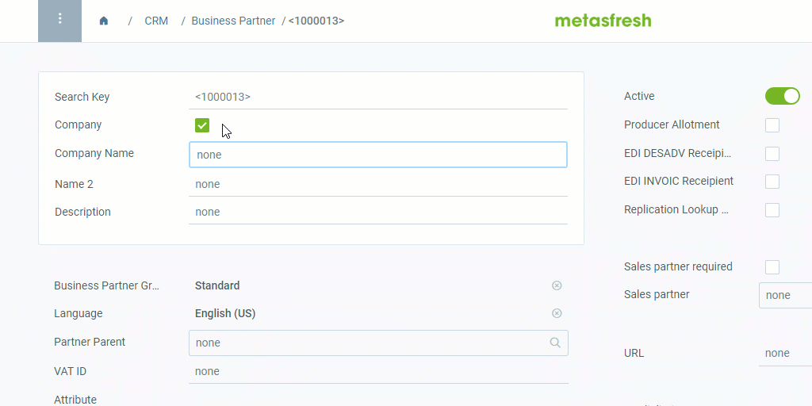
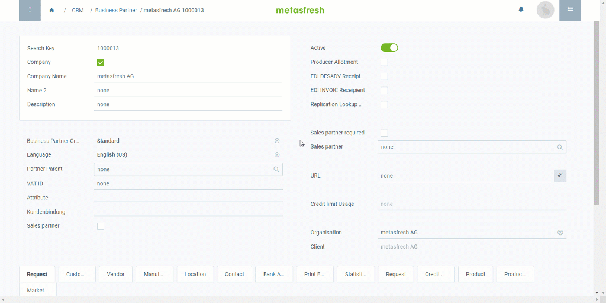
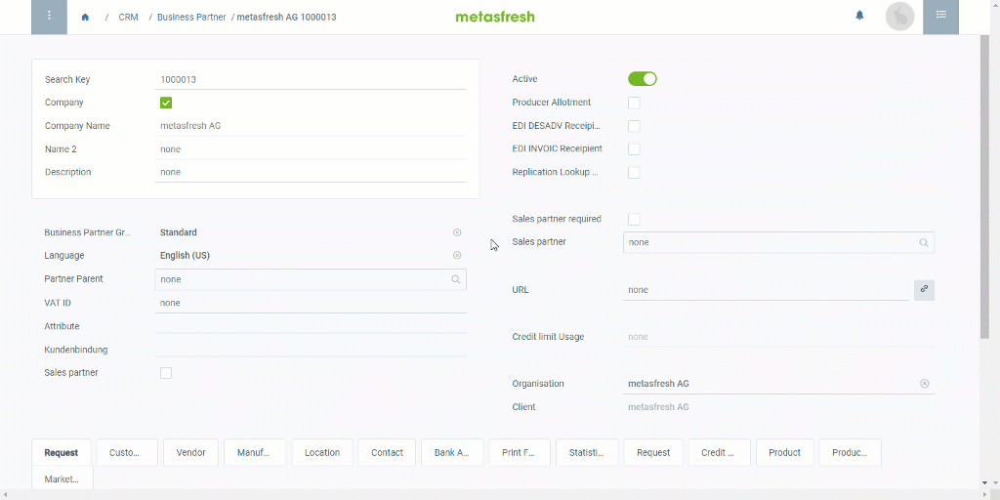

## Overview
The address on documents such as [order confirmation](SalesOrder_recording), [delivery note](Ship_SalesOrder), [invoice](Invoice_SalesOrder), etc. in metasfresh comprises a set of different data.

The following example shows you which data are used to compose a document address:

  

| Document address | Source | Where can I find it? | Video |
| :--- | :--- | :--- | :---: |
| metasfresh AG | Business Partner | Window **Business Partner** &#8658; Field **Company Name** / **Name** | <kbd></kbd> |
| metasfresh AG | Name of Business Partner | Window **Business Partner** &#8658; Tab **Location** &#8658; Field **Name of BPartner** | <kbd></kbd> |
| Mr. Norbert Wessel | Contact | Window **Business Partner** &#8658; Tab **Contact** &#8658; Fields **Greeting**, **First Name** and **Last Name** | <kbd></kbd> |
| Am Nossbacher Weg 2 | Street & House No. | Window **Business Partner** &#8658; Tab **Location** &#8658;  (Field **Address**) &#8658; Field **Street & House No.** | <kbd></kbd> |
| IT Department | Address 2 | Window **Business Partner** &#8658; Tab **Location** &#8658;  (Field **Address**) &#8658; Field **Address 2** | <kbd></kbd> |
| 53179 | ZIP | Window **Business Partner** &#8658; Tab **Location** &#8658;  (Field **Address**) &#8658; Field **ZIP** | <kbd></kbd> |
| Bonn | City | Window **Business Partner** &#8658; Tab **Location** &#8658;  (Field **Address**) &#8658; Field **City** | <kbd></kbd> |
| Germany | Country | Window **Business Partner** &#8658; Tab **Location** &#8658;  (Field **Address**) &#8658; Field **Country** | <kbd></kbd> |

## Next Steps
1. [Add a new business partner](New_Business_Partner).
1. [Add an address for a business partner](Add_address_tab).
