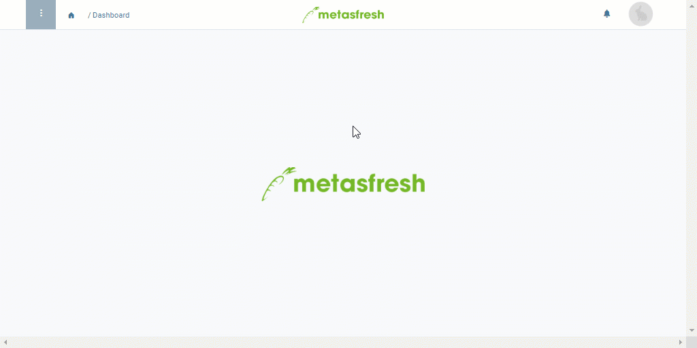

## Overview
An aggregation product is a special product used in [sales orders](SalesOrder_recording) and [quotations](Create_SalesQuotation) to combine multiple order lines into compensation groups for further joint processing.

During [group discounting](Order_line_group_discount), for instance, a [*discount product*](Create_manual_compensation_groups) is applied to combine the selected order lines into a group and then apply joint discounts or surcharges.

When [creating bills of materials from a quotation](Create_BOM_upon_SO_generation), the aggregation product helps to join manufacturing parts into quotation groups that then serve as the basis for the creation of the bill of materials and the sales product.

An aggregation product is basically added like any other normal [product](NewProduct) too, taking into account the following application-specific configuration:

## Steps
1. Open "Product" from the [menu](Menu).
1. [Add a new product](New_Record_Window).
1. Enter a meaningful **Name**, e.g., "Discount".
1. Select an appropriate **Product Category**, e.g., *Aggregation product*.
1. Uncheck the box **Stocked**.
1. [Add the product to a price list](ProductPrice).
1. [metasfresh saves the progress automatically](Saveindicator).

| **Important!** |
| :- |
| The aggregation product must ***not be stocked*** and it must be linked to the very ***same price list*** as in the sales order where it shall be used! |

## Example

