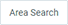
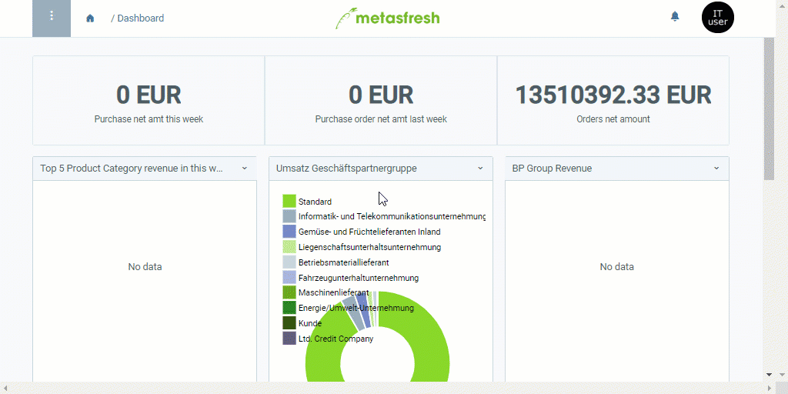

## Overview
In many windows that include entries associated with [business partners](New_Business_Partner) (e.g., in the menu under [sales order](SalesOrder_recording), [purchase order](CreatePurchaseOrder), [business partner](New_Business_Partner), [phone call schedule](Phone_call_scheduling), etc.), you can use the area search to limit the search results to a specific geographical area.

In addition, you can start location-specific area searches directly from the business partner entry, where the results are suggested based on the selected address.

## Requirements
1. [Set up a geocoding service for the area search](Setup_geocoding_service).
1. [Add a business partner along with an address](Add_address_tab).

   | **Important note!** |
   | :--- |
   | For the area search to work smoothly, the business partner address must include ***at a minimum*** a postal code (**ZIP**), the **City** and the **Country**. |

## Steps

### a) Use filter for area search
1. [Open a window](Menu) of your choice where the area search is available in [list view](ViewModes#list-view), e.g., "[Business Partner](Menu)".
1. Click  at the top left of the window and then click .
1. As required, enter **Street & House No.**, **ZIP**, **City** and/or **Country**.
1. Enter a **Distance** and click .
 >**Note:** Press `Alt` + `↵ Enter` / `⌥ alt` + `↵ Enter` to apply the filter criteria.

### b) Location-specific area search
1. Open the entry of an existing [business partner](Menu) in the [detailed view](ViewModes#detailed-view) or [add a new one](New_Business_Partner).
1. Go to the record tab "Location" at the bottom of the page.
1. [Select](RecordSelection) a [location entry](Add_address_tab) of your choice that shall be used as starting point for the area search.
1. [Start the action](StartAction#actions-menu) "Area Search". An overlay window opens up.
1. Enter a **Distance**.
1. Click "Start" to close the overlay window and begin the area search.
1. The results of the area search [found by the filter](Filtering_function) open up in a new browser tab.

   | **Note:** |
   | :--- |
   | You can also start this action from the actions menu in the [list view](ViewModes#list-view) if you have selected a business partner entry. If the entry contains more than one address, the one that was first entered will be used for the area search. |

## Example
<kbd></kbd>
