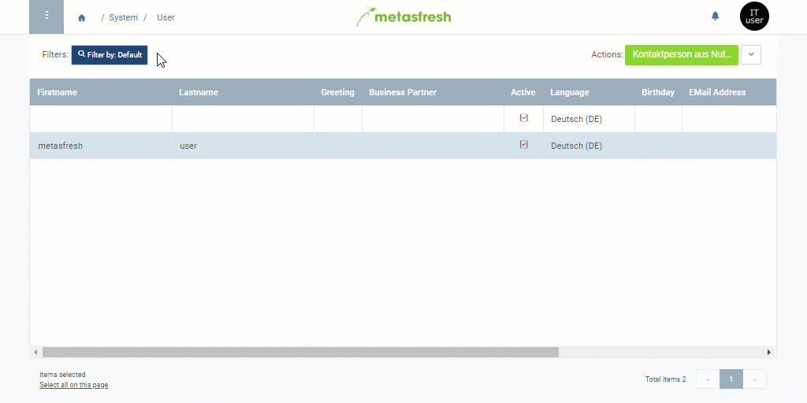

## Steps
1. Open the entry of an existing [user](Menu) or [add a new one](Add_user).
1. Go to the field **Business Partner**, enter a part of the required [business partner](New_Business_Partner) name or number and click on the matching result in the [drop-down list](Keyboard_shortcuts_reference).
1. [metasfresh saves the progress automatically](Saveindicator).
  

| **Note:** |
| :- |
| The user entry will now also appear under the record tab "Contact" at the bottom of the page of the respective business partner entry under "[Business Partner](Menu)" in the menu. |

## Example

