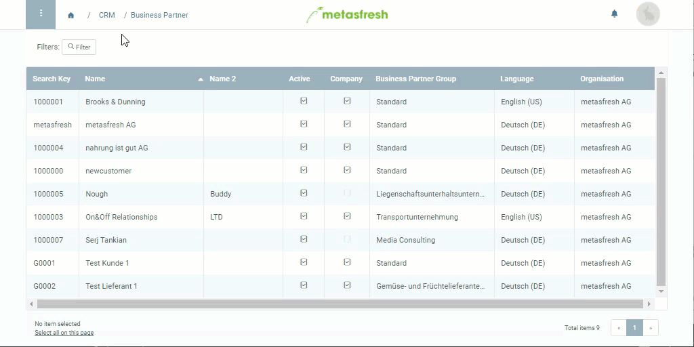

## Overview

In metasfresh there are [sales price lists and purchase price lists](Add_price-list). The sales price lists can be assigned to customers and the purchase price lists to vendors. These two types of price lists can also be assigned to partner groups.

## Assign Sales Price List to Customer
In order to obtain a *sales price list* you have to check the box **Sales Price List** in the corresponding [price list](Add_price-list) entry. Once this is done, you can continue with these steps:

### Steps
1. Open the entry of an existing customer from your [business partners](Menu) or [add a new one](New_business_partner_customer).
1. Go to the record tab "Customer" at the bottom of the page.
1. Double-click the field **Price System** of the customer line and select the desired [price system](Add_price-system) from the drop-down list.
1. [metasfresh saves the progress automatically](Saveindicator).

---

## Assign Purchase Price List to Vendor
In order to obtain a *purchase price list* you have to uncheck the box **Sales Price List** in the corresponding [price list](Add_price-list) entry. Once this is done, you can continue with these steps:

### Steps
1. Open the entry of an existing vendor from your [business partners](Menu) or [add a new one](New_business_partner_vendor).
1. Go to the record tab "Vendor" at the bottom of the page.
1. Double-click the field **Purchase Price System** of the vendor line and select the desired [price system](Add_price-system) from the drop-down list.
1. [metasfresh saves the progress automatically](Saveindicator).

## Example

---

## Assign Price List to Partner Group
1. Open the entry of an existing [business partner](Menu) or [add a new one](New_Business_Partner).
1. [Jump to the content of the field](Jumpto) [**Business Partner Group**](New_Business_Partner_Group). The respective business partner group entry opens up in a new window.
1. Now, in this window, select the desired **Price System**.
1. [metasfresh saves the progress automatically](Saveindicator).

## Example

