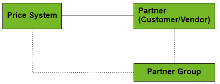
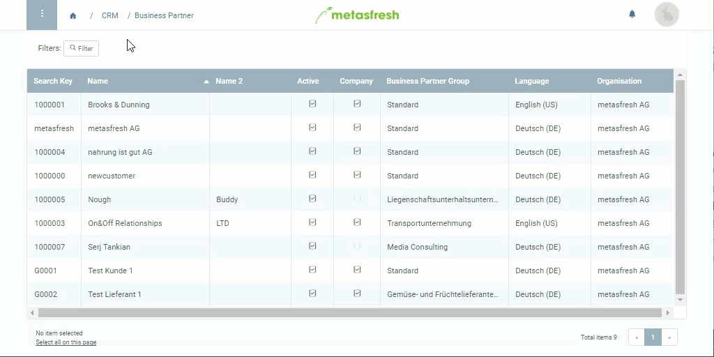

## Overview

In metasfresh, there are *sales price lists* and *purchase price lists*. The sales price lists can be assigned to [customers](New_business_partner_customer) and the purchase price lists to [vendors](New_business_partner_vendor). These two types of price lists can also be assigned to [partner groups](Assign_prices_to_partner_group).

## Steps

### Assign sales price list to customer
In order to obtain a *sales price list* you have to tick the checkbox **Sales Price List** in the corresponding price list entry (see **step 8** of "[How do I add a price list?](Add_price-list)"). Once this is done, you can continue with these steps:

1. Open the entry of an existing customer from your [business partners](Menu) or [add a new one](New_business_partner_customer).
1. Go to the record tab "Customer" at the bottom of the page.
1. Double-click the field **Price System** of the customer line and pick the desired [price system](Add_price-system) from the drop-down list.
1. [metasfresh saves the progress automatically](Saveindicator).

---

### Assign purchase price list to vendor
In order to obtain a *purchase price list* you have to uncheck the box **Sales Price List** in the corresponding price list entry (see **step 8** of "[How do I add a price list?](Add_price-list)"). Once this is done, you can continue with these steps:

1. Open the entry of an existing vendor from your [business partners](Menu) or [add a new one](New_business_partner_vendor).
1. Go to the record tab "Vendor" at the bottom of the page.
1. Double-click the field **Purchase Price System** of the vendor line and pick the desired [price system](Add_price-system) from the drop-down list.
1. [metasfresh saves the progress automatically](Saveindicator).

## Next Steps (alternative)
- [Assign price lists to an entire business partner group](Assign_prices_to_partner_group).

## Example

