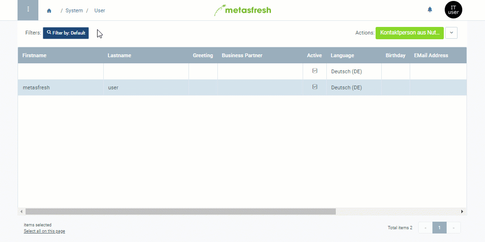

## Overview
By means of a user role you can determine the extent of the user permissions.

## Steps
1. Open "User" from the [menu](Menu).
1. Open the entry of an existing system user or [add a new one](New_system_user).
1. Go to the record tab "[User Roles](NewUserRole)" at the bottom of the page and click . An overlay window opens up.
1. Select the role you want to assign to the system user.
1. Click "Done" to close the overlay window and add the role to the list.
 >**Note:** A system user can have several roles. In such a case, they will be asked to choose a role at the [login](Login).

## Next Steps (optional)
- [Assign a business partner to the user](Assign_BPartner_to_user).

## Example

