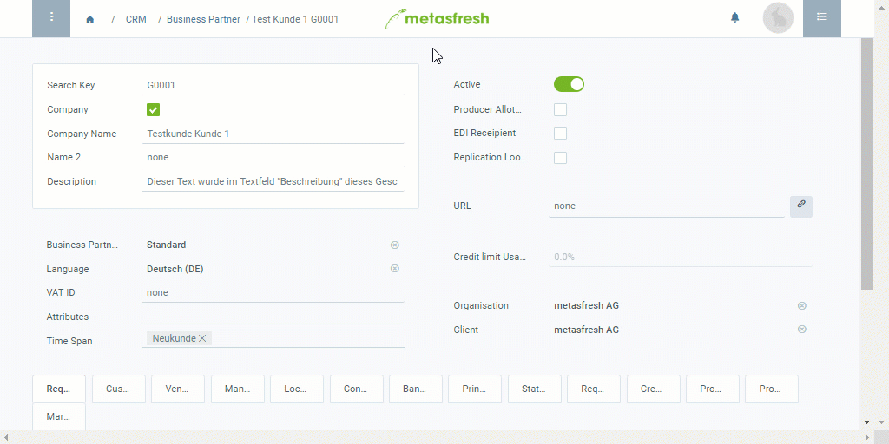

## Overview
You can record special memos with information of potential importance about a business partner that will be displayed in a tooltip in [sales orders](SalesOrder_recording) or [purchase orders](CreatePurchaseOrder) when clicking on the tooltip icon  to the right of the partner's name.

## Steps
1. Open the entry of an existing [business partner](Menu) or [add a new one](New_Business_Partner).
1. Open the [advanced edit menu](ViewModes) from the [actions menu](StartAction).
 >**Note:** Use shortcut `Alt` + `E` / `⌥ alt` + `E`.

1. Scroll down to the text box **Memo** and enter some information to be displayed in the tooltip.
1. Click "Done" to apply the changes and close the advanced edit menu.
1. [metasfresh saves the progress automatically](Saveindicator).

## Example

