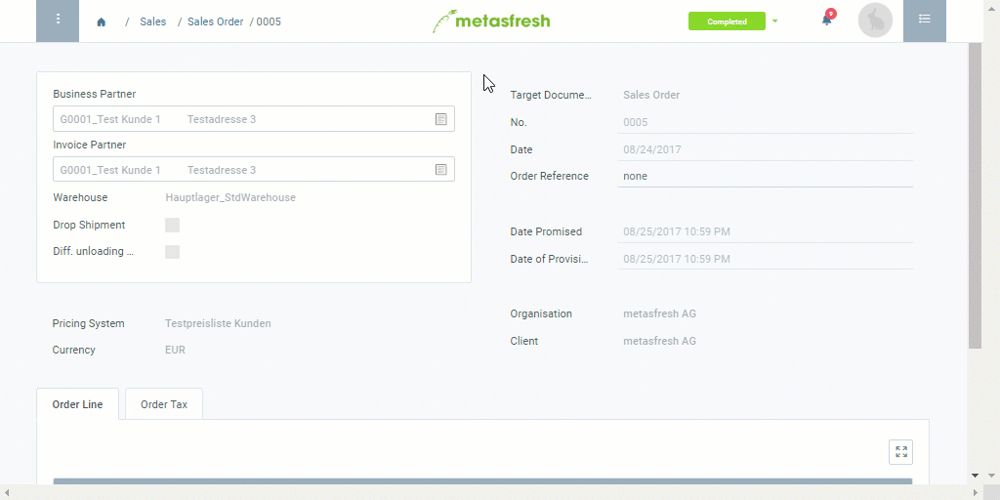

## Overview
In metasfresh, you can easily change the name and/or address of the invoice recipient either after completing a sales order (i.e. before invoicing) or even after the invoice documents have been created. In the latter case, however, the existing invoice must first be canceled and then generated again after the changes have been made.

| **Important Note:** |
| :- |
| The different [billing addresses](Add_address_tab) and [contacts](Add_user_to_BPartner) must be recorded in the respective [business partner](New_Business_Partner)'s entry beforehand so that metasfresh can then make them available to you for selection for subsequent changes. |

## Steps

### a) Before invoicing
1. Open "Sales Order" from the [menu](Menu).
1. Open the entry of a [completed sales order](SalesOrder_recording) for which you want to change the bill-to information.
1. [Jump to](JumptoviaSidebar) "Invoice Disposition" and open the entry of the corresponding billing candidate.
1. Open the [advanced edit menu](ViewModes) from the [actions menu](StartAction).
 >**Note:** Use shortcut `Alt` + `E` / `⌥ alt` + `E`.

1. In the field **Rechnungsadresse abw.**, select a new billing address.
1. In the field **Rechnungskontakt abw.**, select a new billing contact.
1. Click "Done" to apply the changes and close the advanced edit menu.
1. [metasfresh saves the progress automatically](Saveindicator).
1. [Create the invoice](Invoice_SalesOrder) with the new bill-to information.

### b) After invoicing
1. [Cancel the invoice](Invoice_reverse_correct) whose bill-to information you want to change.
1. Proceed with the above **instructions a)** from **step 3**.

## Example

