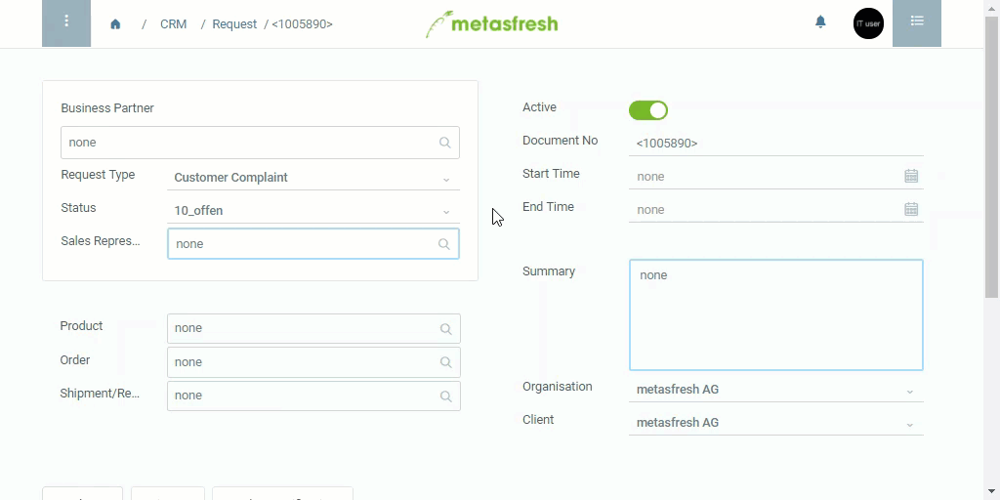

## Overview
Opportunities are potential sales possibilities that are indicated by a percentage of their probability.

In metasfresh, opportunities are managed as *request types* with different status possibilities:

| Status | Description |
| :--- | :--- |
| 10% | Starting Point |
| 25%, 50%, 75% | Increasing probability |
| 100% | Acquired |
| 0% | Lost |

## Steps
1. Open "Request" from the [menu](Menu).
1. [Create a new request](New_Record_Window).
1. In the field **Business Partner**, enter part of the [business partner](New_Business_Partner) name or number and click on the matching result in the <a href="Keyboard_shortcuts_reference#dropdown" title="Dynamic Search Box (Autocompletion)">drop-down list</a>.
1. Select the **Request Type** *Opportunity*.
1. Under **Status** select the relevant probability and, if necessary, update it according to current changes.
1. [metasfresh saves the progress automatically](Saveindicator).

## Example

