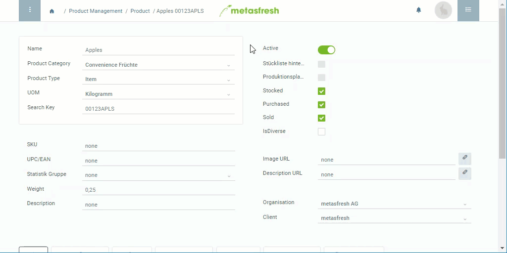

## Overview
A product is a [consumer unit (CU)](Handling_Unit_System) which in bigger amounts can be packed into a [transport unit (TU)](Handling_Unit_System). The type of TU to be used is specified by [packing instructions](Create_packing_instructions).

## Steps
1. Open the entry of an existing [product](Menu) or [add a new one](NewProduct).
1. Go to the record tab "CU-TU Allocation" at the bottom of the page and click . An overlay window opens up.
1. Select some **Packing Instructions**, e.g., *IFCO*.
1. ***Option 1:*** Enter a specific fixed **Quantity** to put into the TU. The **UOM** is always the product's stock-keeping UOM. 
***Option 2:*** If the quantity is unknown or variable, tick the checkbox **Unspecified Capacity**.
1. Set a **Valid from** date.
 >**Note:** If this date lies in the *past*, the packing instructions are effective *immediately*. If it lies in the *future*, they will only apply *from that date*. metasfresh suggests the currently valid packing instructions automatically based on the date promised of sales orders or purchase orders.

1. ***Optional:*** Add a [**Business Partner**](New_Business_Partner) if you want to activate these packing instructions for this partner only.
1. Click "Done" to close the overlay window and add the allocation to the list.
 >**Note:** Repeat steps 2 to 7 to add further allocations with different packing instructions to the list.

## Next Steps
- [Tie the packing instructions to a price](Add_packing-instructions_to_price).

## Example

