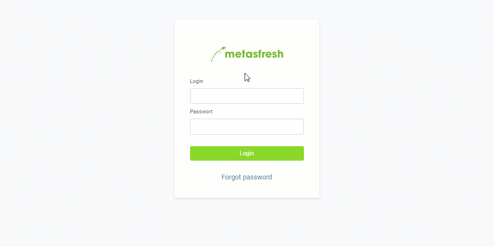
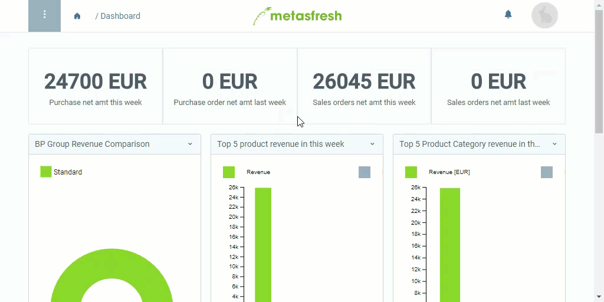

## Overview
If you are having a hard time remembering your login password or simply want to change it, just follow the "Forgot password" feature the next time you log in and reset your password or pick a new one.

## Change password (Forgot password)
1. On the login page, click on the "Forgot password" link below the login button. A new input field appears.
1. In the input field, enter your user email address which is registered in metasfresh and click .
1. You will receive an email from metasfresh containing password reset instructions.
1. Open the email in your inbox and click on the included link. A new browser tab opens up.
1. Enter your **New Password** with at least 8 characters.
 >**Note 1:** Make sure the password consists of ***at least 8 characters*** or it ***will not be saved***!  
 >**Note 2:** Please note that the password is ***case-sensitive***!

1. Repeat your **New Password (retype)**.
1. Click  and log in as usual.

## Example

---

## Change password (at whim)
1. Open the user menu  in the upper right corner of the menu bar.
 >**Note:** Use shortcut `Alt` + `4` / `⌥ alt` + `4`.

1. Click on "Settings".
1. [Start the action](StartAction) "Change my password". An overlay window opens up.
1. Enter your **Old Password**.
 >**Note:** Press and hold  to see the password.

1. Enter your **New Password** with at least 8 characters.
 >**Note 1:** Make sure the password consists of ***at least 8 characters*** or it ***will not be saved***!  
 >**Note 2:** Please note that the password is ***case-sensitive***!

1. Repeat your **New Password (retype)**.
1. Click "Start" to apply the changes and close the overlay window.

## Example

