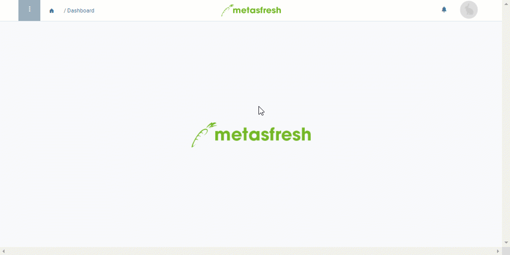

## Overview
In metasfresh you can duplicate product prices along with all details to avoid having to enter all data from scratch when making only small changes, e.g., in cases where you want to store the same product on a price list with different packing instructions. The duplicated (cloned) product price is initially marked as "invalid" so that no conflicts arise in the price calculation due to the duplicates. As soon as the cloned product price has been adjusted, you can manually revalidate it and it will be taken back into consideration by the price engine.

## Steps

### Clone product price
1. Open "Product Prices" from the [menu](Menu).
1. [Clone the entry of an existing product price](clone_record_window). The cloned product price will initially be ignored by the price engine.  

### Manually revalidate product price
1. Apply the changes you want to make to the cloned product price, e.g., by changing its packing instructions.
1. Uncheck the box **Ignore price**.
1. [metasfresh saves the progress automatically](Saveindicator).

## Example

