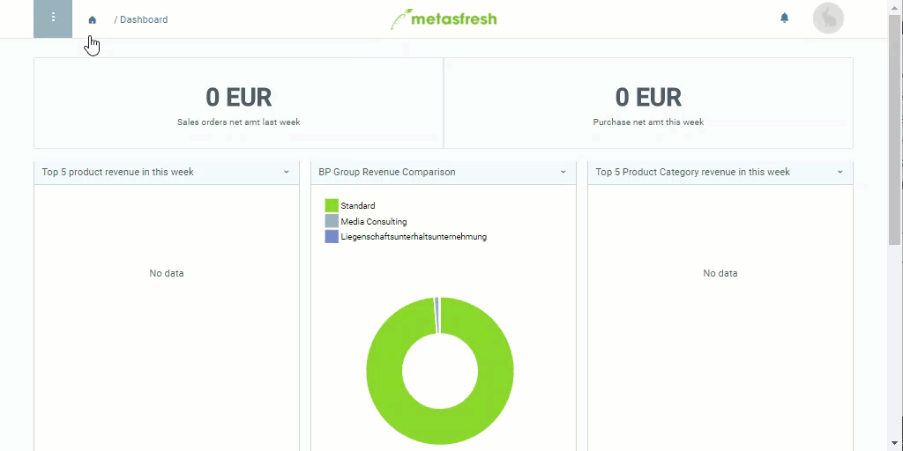

## Overview
In metasfresh, you can sort products with similar features into categories for clearer organization. During [group discounting](Order_line_group_discount), these product categories in connection with a [compensation group schema](Create_compensation_group_schema) make it possible to [automatically combine](Create_automatic_compensation_groups) the products of one category into a compensation group.

In order to link the compensation group schema to a product category, please proceed as follows:

## Steps
1. Open "Product Category" from the [menu](Menu).
1. Open the entry of an existing product category or [add a new one](NewProductCategory).
1. Go to the field **Compensation Group Schema** and pick the desired schema, e.g., *Compensation Group I*.
1. [metasfresh saves the progress automatically](Saveindicator).

## Alternate Configuration - Subcategorization
Instead of linking a product category to a compensation group schema, you can also subordinate it to another category which in turn is linked to a compensation group schema. Consequently, during [group discounting](Order_line_group_discount) the schema of the *parent category* will be applied to the compensation group. This way you can sort individual products into different categories and still give discounts on them as a group.

[Follow these instructions](ParentProductCategory) to set a parent product category.

## Example

