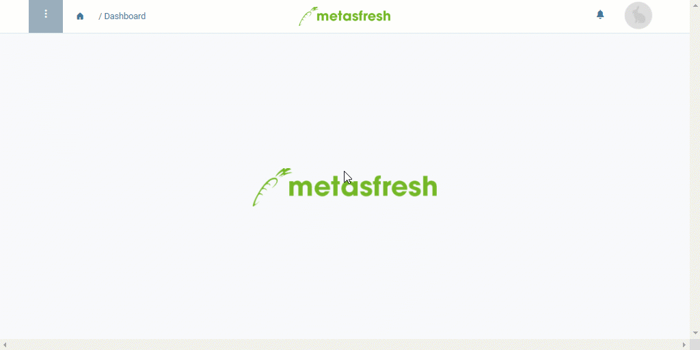

## Requirements
- [Create a discount schema](Create_discount_schema) where discount lines from other existing discount schemas can be copied.

## Steps
1. Open "Rabatte Zeilen" (*Discount Lines*) from the [menu](Menu). This is where all discount lines from all existing discount schemas are listed.
1. ***Optional:*** [Use the filter](Filtering_function) to sort the [list view](ViewModes) by specific discount lines.
1. [Select](RecordSelection) the discount lines you want to copy.
1. [Start the quick action](StartAction) "Copy to Discount Schema". An overlay window opens up.
 >**Note:** You will also find this action in the actions menu in the list view.

1. Pick the **Discount Schema** where you want to copy the selected discount lines.
1. Click "Start" to copy the discount lines and close the overlay window.
1. [metasfresh saves the progress automatically](Saveindicator).

| **Note:** |
| :--- |
| You can view the discount schema with the copied discount lines under "[Discount Schema](Menu)" in the menu. |

## Example

