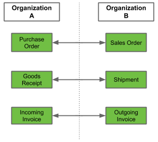
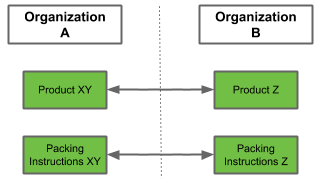

## Overview
metasfresh not only allows you to manage multiple legal entities in one system through [organizations](Org_add_new_organization), but it can also be configured to automatically generate corresponding counter documents when these organizations do business with each other.

For example, if an organization A ([customer](New_business_partner_customer)) places a [purchase order](CreatePurchaseOrder) with an organization B ([vendor](New_business_partner_vendor)), a [sales order](SalesOrder_recording) from organization A will be automatically created for organization B, and vice versa.

<kbd></kbd>

In order to enable both organizations to manage their products and packing materials individually, you can link corresponding master data together.

<kbd></kbd>

## More pages about counter documents



## Sample Process
1. A user from Org. A completes a purchase order for Org. B.
1. A sales order is automatically created for Org. B with Org. A as the customer, including all corresponding products and packing instructions.
1. The sales order at Org. B will remain uncompleted for visual inspection.

## Inspection
1. Once a day metasfresh sends out a list of the created counter documents.
1. If a counter document cannot be created, e.g., because linked master data are missing, you will receive an error message.
1. Counter documents that could not be created are listed under "[RV_Missing_Counter_Documents](Menu)" (*Missing Counter Documents*) in the menu. To see this window you have to [log in to metasfresh](Login) with the [user role](NewUserRole) "Admin".
