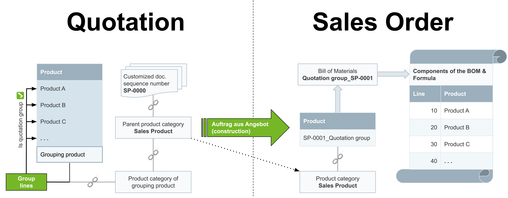

## Overview
If you combine multiple products intended for the manufacturing of a new sales product into a compensation group in a quotation and then convert it into a sales order, metasfresh will automatically transform the quotation group into a verified bill of materials and immediately make the newly assembled sales product available for future orders without any extra work. In the process, the respective quantities of the quotation group components are added to the bill of materials in the exact same amount.

## Requirements
- [Set up the automatic BOM creation upon sales order generation](Create_BOM_upon_SO_generation_setup).

## Steps

### Create a quotation with a quotation group
1. [Create a quotation](Create_SalesQuotation) including the desired products and quantities, but ***do not complete it yet***.
 >**Note:** The product quantities from the quotation will be added to the bill of materials in the exact same amount upon sales order generation.

1. [Create a manual compensation group (from **step 2**)](Create_manual_compensation_groups) using a [grouping product that has been activated for quotation grouping](Add_grouping_product).
 >**Note 1:** The name of the compensation group will be used for naming the bill of materials and the associated sales product.  
 >**Note 2:** The grouping product is added in a separate line and does not appear on subsequent documents.

1. [Complete the quotation](DocumentProcessingComplete).

### Convert the quotation into a sales order
1. [Start the action](StartAction) "Auftrag aus Angebot (construction)" (*Create Sales Order from this Quotation (construction)*). An overlay window opens up.
1. Pick the **Document type** *Sales Order*.
1. Click "Start" to close the overlay window and create the sales order.

### View the new sales product and BOM
1. Go to the record tab "Order Line" at the bottom of the page of the completed sales order and [zoom into](Zoom_into_table_field) the field in the column **Product** of the order line. The new product's entry opens up in a new browser tab.
1. Use the product entry's [related documents to jump](JumptoviaSidebar) into "Bill of Materials & Formula" (under PRODUCT MANAGEMENT in the sidebar) and then open the associated bill of materials which has already been [found by the filter](Filtering_function).

## Example

