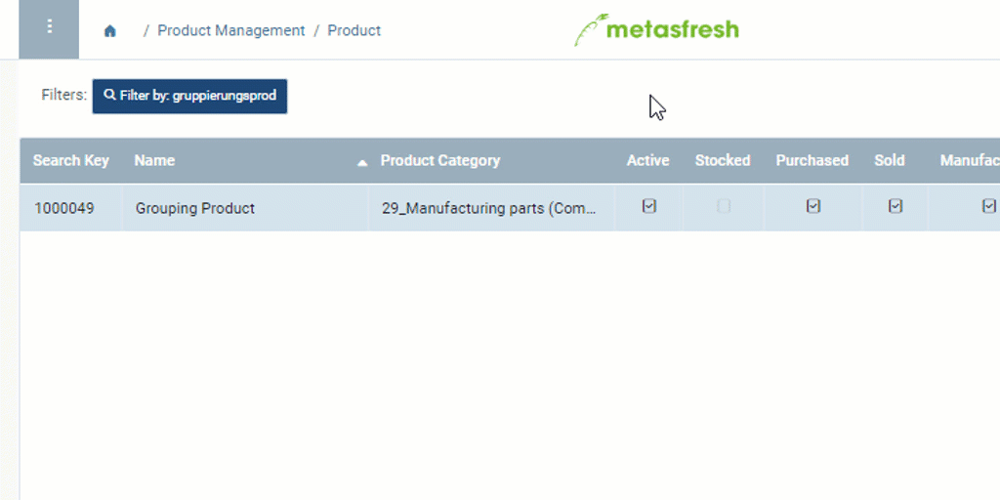

## Overview
When creating [quotations](Create_SalesQuotation) in metasfresh, you can take individual [products](NewProduct) that combined with each other make a new sales product, and turn them into quotation groups (generally also referred to as *compensation groups*). If your customer accepts the offer, you can simply convert the quotation into a sales order and get the shipment of the new product under way.

During the conversion, metasfresh will automatically create a bill of materials consisting of the combined manufacturing parts, immediately making the newly assembled sales product available for future orders without any extra work.

<kbd></kbd>

## Steps

### Add grouping product with a parent product category
1. [Add a grouping product](Add_grouping_product) that serves to identify products as quotation groups.
 >**Note:** Make sure the grouping product is activated for quotation grouping.

1. Set a [parent product category](ParentProductCategory) for the grouping product's product category.
 >**Note:** The **parent product category** is required for categorizing the assembled sales product.

1. Make sure the parent product category has an individual [document sequence](Define_new_doc_sequence).
 >**Note:** This sequence is required for sequencing the bill of materials and the associated sales product.

### Check for availability of a product planning schema
1. Open "Product Planning Schema" from the [menu](Menu).
1. Open the entry provided there by default.
1. Make sure the field **M_ProductPlanningSchema_Selector** is set on *Angebotsprodukt Plandaten Schema Selektor* (*Quotation product planning schema selector*).
1. Don't make any other changes!

## Next Steps
 - [Automatically create a bill of materials consisting of the compensation group from a quotation by converting it into a sales order](Create_BOM_upon_SO_generation).

## Example
<kbd></kbd>
