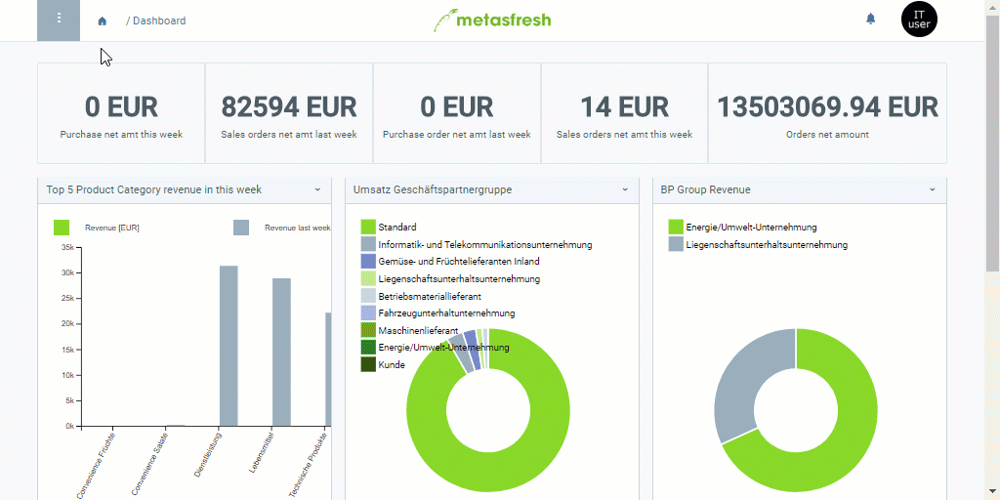

## Overview
A marketing campaign enables you to provide a large number of your contacts with information of interest to them at just one go and with a minimum amount of effort. Marketing campaigns can be synchronized bidirectionally (i.e. from metasfresh to the [marketing platform](Create_MKTG_platform) and vice versa), thus keeping all contact data up to date at all times.

In metasfresh, there are two types of marketing campaigns: *email campaigns* and *serial letter campaigns*.

In the *email campaigns*, newsletters are sent by email to the selected contacts. In the *serial letter campaigns*, hardcopy [serial letters](Create_serial_letters) are created and automatically provided with the respective contacts' default address stored in metasfresh, ready to be printed out and sent by mail.

## Requirements
The following components are required for a marketing campaign:
- A [marketing platform](Create_MKTG_platform) defining the address type of the marketing contacts.
- A [boilerplate](Create_boilerplate) with a text template for the emails or serial letters.

## Steps
1. Open "Marketing Campaign" from the [menu](Menu).
1. [Create a new marketing campaign](New_Record_Window).
1. Give the marketing campaign a **Name**.
1. Enter part of the **Marketing Platform** and click on the matching result in the <a href="Keyboard_shortcuts_reference#dropdown" title="Dynamic Search Box (Autocompletion)">drop-down list</a>.
1. Set a **Start Date**.
1. Set an **End Date**.
1. Pick a **Boilerplate** (*Textbaustein*).
1. [metasfresh saves the progress automatically](Saveindicator).

## Next Steps
1. [Add contacts to the marketing campaign](Add_contacts_to_MKTG_campaign).
1. [Synchronize the marketing campaign with the marketing platform](Sync_MKTG_campaign_with_platform).

## Example
<kbd></kbd>
