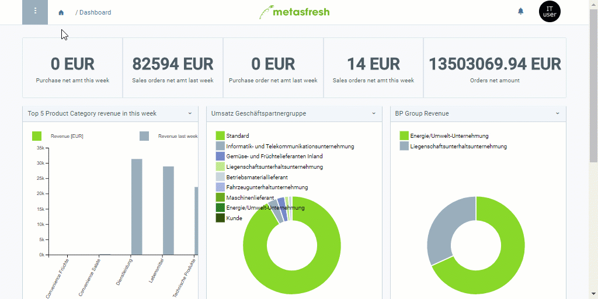

## Steps
1. Open "Marketing Platform" from the [menu](Menu).
1. [Create a new marketing platform](New_Record_Window).
1. Select a **Marketing Platform Gateway ID**, e.g., *CleverReach*.
1. Give the marketing platform a **Name**.
1. Check the box **Requires Location**.
1. [metasfresh saves the progress automatically](Saveindicator).

## Example

