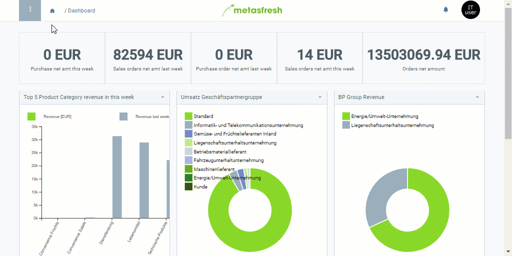

## Overview
You can use boiler plates to create text templates for letters and [emails](Send_email_from_system), which you can also use in marketing campaigns, such as [serial letter campaigns](Create_serial_letters).

## Steps
1. Open "Boiler Plate" from the [menu](Menu).
1. [Create a new boiler plate](New_Record_Window).
1. Give the boiler plate a **Name**.
1. Enter a **Subject**.
1. In the text box **Text Snippet**, enter a text.
1. [metasfresh saves the progress automatically](Saveindicator).

## Example

