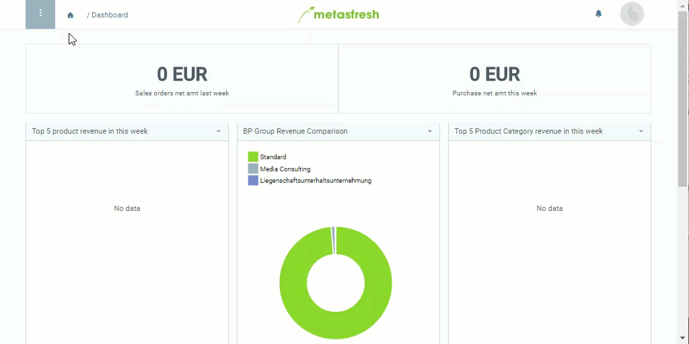

## Overview
A compensation group scheme allows you to determine which products will be automatically combined into a compensation group in a sales order.

## Steps
1. Open "Compensation Group Schema" from the [menu](Menu).
1. [Create a new compensation group scheme](New_Record_Window).
1. Give the scheme a **Name**, e.g. "Compensation Group I".
1. Go to the record tab "Products" at the bottom of the page and click . A new window opens up.
1. Select a **Product**, e.g. [*Group discount*](Product_for_group_discount).
 >**Note:** You can select any product from the list in the product field.

1. Optionally, you can enter a **Discount %** right here which will then be applied directly when creating the compensation group. However, you can also leave it at 0 and manually enter the discount amount later in the sales order.
1. Click "Done" to close the window and add the discount product to the list.
1. [metasfresh saves the progress automatically](Saveindicator).

## Next Steps
- [Link the compensation group scheme to a product category](Compensation_group_scheme_product_category).

## Example

